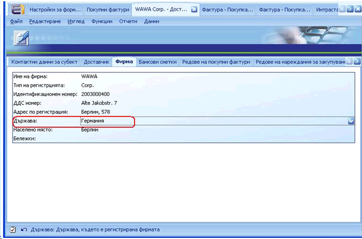
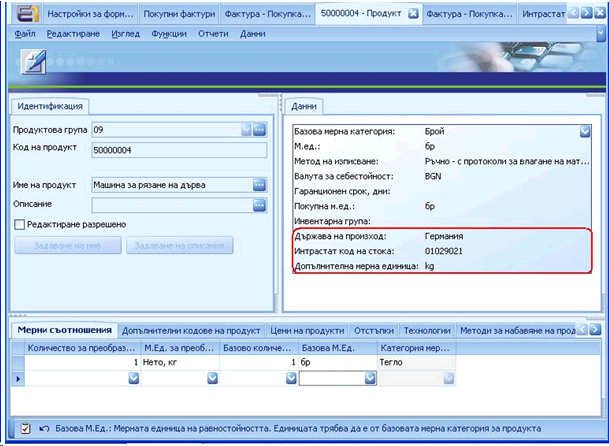
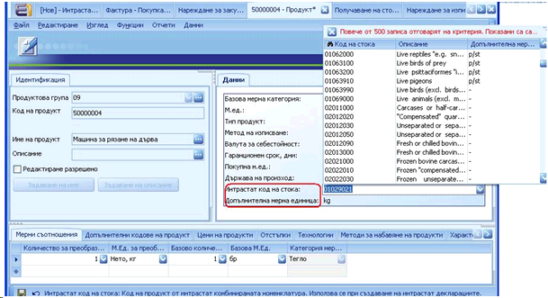
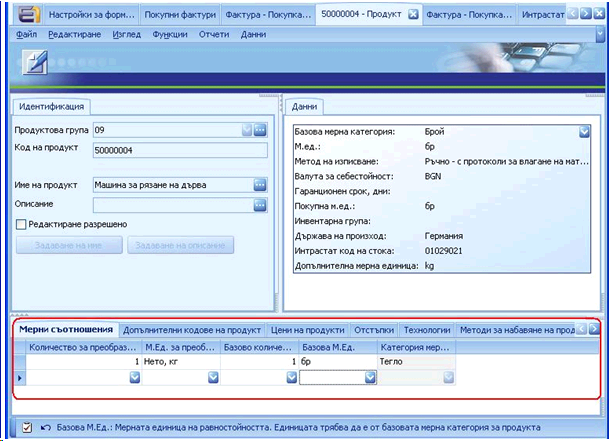
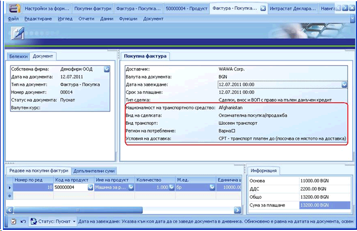
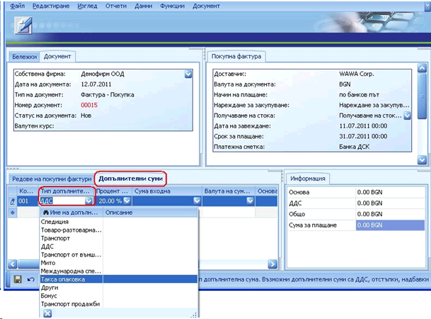
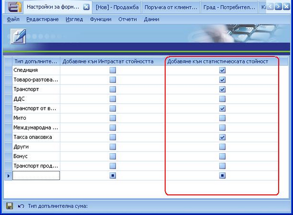

# Попълване на документи за Интрастат  декларации в посока Пристигане

За да се генерира  **Интрастат декларация за  Пристигания**, е необходимо да бъдат  попълнени задължителните за Интрастат полета в следните документи: 

-  Дефиниция за **Доставчик** 
-  Форма **„Продукт”**
-   Документ **„Покупна Фактура”** **(Главно меню >> Финанси  >> Разходи >> Създаване на Фактура -  Покупка)**    

### Дефиниция Доставчик 

В панел **Фирма** освен стандартните полета е необходимо да се попълни и поле **„Държава”** на доставчика.

### **Форма „Продукт”** 

 В панел **Данни** за продукта освен стандартните полета, трябва да се  попълнят и задължителните такива, които са пряко свързани с генерирането на  Интрастат декларация. В панел **Данни** те са следните:   

- **Държава на  произход**   
- **Интрастат код на  стоката** (виж тема „Генериране на Интрастат  кодове на стоки и Административен  регион”)  
- **Допълнителна мерна  единица**

Ако избраният Интрастат код на стоката изисква  допълнителна  мерна единица, то тя трябва да се въведе в  съответното поле. В противен случай, системата няма да позволи дефиницията на  продукта да бъде записана.

Ако продукта ни е в мерна категория, различна от  **„Тегло”,** трябва да се попълнят мерните съотношения между  различните мерни единици в полетата,  намиращи се в панел „Мерни съотношения”:

### **Документ „Покупна Фактура”**

**Главно меню >> Финанси >>  Разходи >> Създаване на Фактура - Покупка** 

При осъществяване на  покупка, която ще бъде отчетена в Интрастат декларацията, в панел **Покупна Фактура** е необходимо да се покажат полетата, които са свързани с отчитането  по Интрастат, тъй като те не са добавени в стандартния изглед в документ  **„Фактура  –Покупка”**. Задължителните полета за  Интрастат декларацията са:    

- **Вид  транспорт**   
- **Вид на  сделката**   
- **Регион на  потребление** – ако това поле не е попълнено,  при генериране на Интрастат Декларацията автоматично ще се вземе стойността на  поле **„Административен  регион”** от дефиницията на собствената  фирма.   
- **Националност на  транспортното средство**   
- **Условия на  доставка**

В панел **Допълнителни суми** има възможност да се добавят допълнителните разходи,  които трябва да влязат в статистическата стойност в **Интрастат Декларацията:**

Допълнителните суми, могат да бъдат  добавяни и махани от документ **Настройки за форматиране на Интрастат  Декларация**: 

**Главно меню >> Финанси >>  Интрастат >> Настройки за форматиране на Интрастат Декларация**

