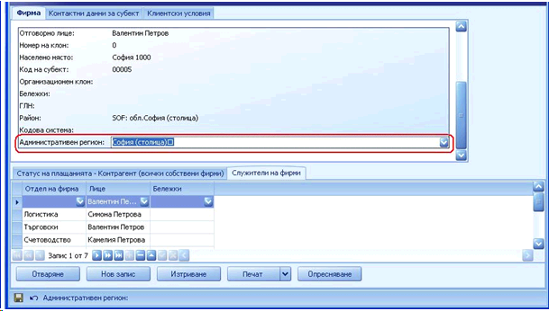
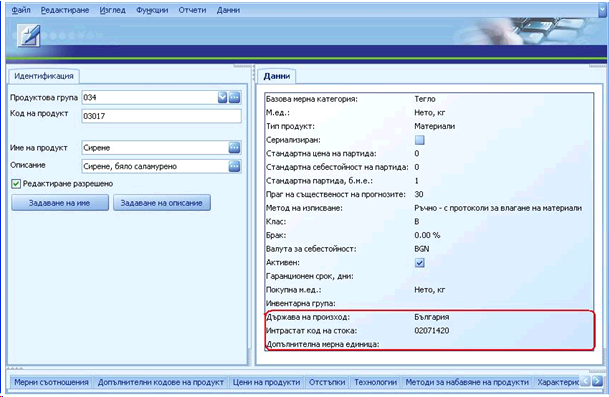
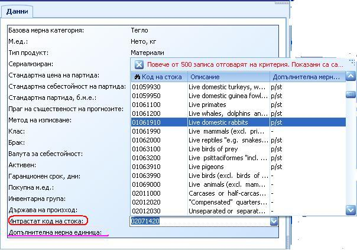
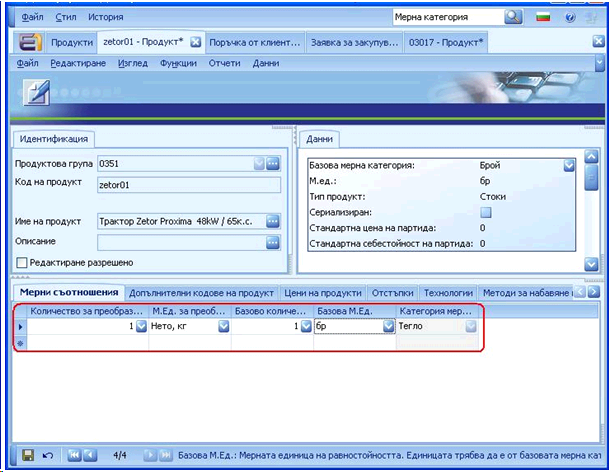
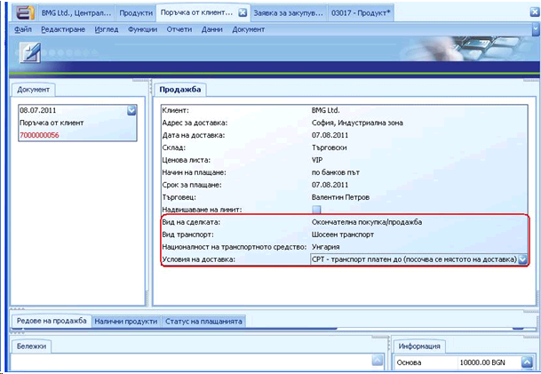
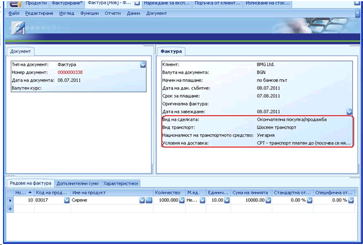

# Попълване на документи за Интрастат  декларации в посока Изпращане

За да се генерира  **Интрастат декларация за  Изпращания**, е необходимо да бъдат попълнени  задължителните за Интрастат полета в следните документи:   

- Дефиниция за собствена  фирма   
- Форма **„Продукт”**   
- Документ „**Продажба”**   
- Документ **„Продажна Фактура”** **(Главно меню >> Клиенти  >> Фактуриране)**   

### **Дефиниция за Собствена  фирма** 

В панел **Фирма** освен стандартните полета е необходимо да се попълни и поле **„Административен регион”** на собствената фирма.

### **Форма „Продукт” ** 

В панел **Данни на продукта** освен стандартните полета, трябва да се попълнят и  задължителните такива, които са пряко свързани с генерирането на Интрастат  декларация. В панел **Данни** те са следните:   

- **Държава на  произход**   
- **Интрастат код на  стоката** *(виж тема „Генериране на Интрастат  кодове на стоки и Административен  регион”)* 
- **Допълнителна мерна  единица**

Ако избраният Интрастат код на стоката изисква  допълнителна мерна единица, то тя трябва да се въведе в съответното поле. В  противен случай, системата няма да позволи дефиницията на продукта да бъде  записана.

Ако продукта ни е в мерна категория, различна от  **„Тегло”,** трябва да се попълнят мерните съотношения между  различните мерни единици в полетата,  намиращи се в панел „Мерни съотношения”:

### **Документ „Продажба”**

При поръчка от клиент,  която ще бъде отчетена в Интрастат декларацията, е необходимо да се [покажат полетата](fieldproperties.htm), свързани с отчитането по  Интрастат, тъй като те не са добавени в стандартния изглед в документ  **„Продажба”**. Задължителните полета за Интрастат декларацията  са:   

- **Вид на  сделката**   
- **Вид  транспорт**   
- **Националност на  транспортното средство**   
- **Условия на  доставка**

### **Документ „Продажна  Фактура”** 

**Главно меню >>  Клиенти >> Фактуриране**

Когато създаваме фактура за текущата продажба, е  необходимо да покажем отново полетата, свързани с отчитането по Интрастат. Щом  ги добавим във форма Фактура, те ще се покажат със заредени стойности, тъй като  вече сме попълнили същите полета в документ **Продажба**. В случай че полетата не са били попълнени коректно или  въобще не са били попълнени в документ **Продажба**, то тогава има възможност да се попълнят директно във  фактурата.

