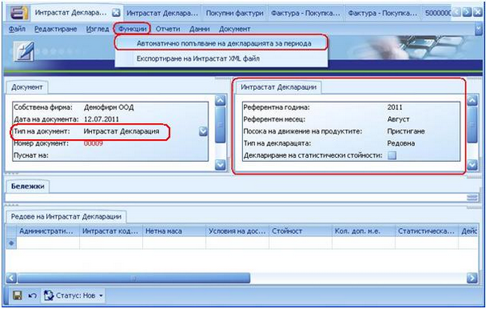
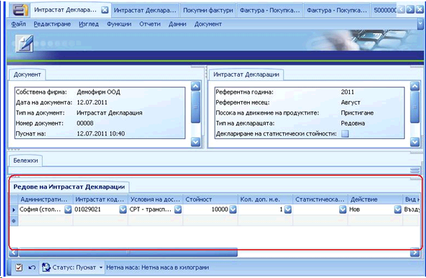
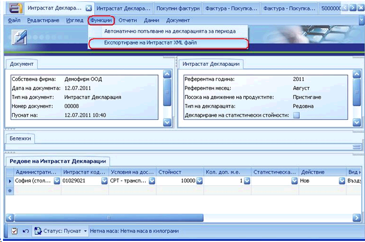

# Генериране и Експортиране на  Интрастат Декларация

Когато всички  необходими документи са попълнени, можем да създадем Интрастат Декларация. За  примера ще изготвим Интрастат Декларация за **Пристигания**: 

### **Създаване на Интрастат  Декларация**  

**Главно меню >> Финанси >>  Интрастат >> Създаване на Интрастат Декларация** 

В панел **Документ** се попълва поле **Тип на документ**. Останалите полета се попълват автоматично.
В панел **Интрастат Декларация**, е необходимо да се попълнят следните полета:

- **Референтна  година** - годината, за която е подготвена  декларацията   
- **Референтен  месец** – месецът, за който е подготвена  декларацията   
- **Посока на движение на  продуктите** – в случая е **Пристигане**   
- **Тип на  декларацията** – определя дали декларацията е  редовна или коригираща   
- **Пощенски код** – пощенски код на подаващия  декларацията

След като полетата в панел **Интрастат Декларация** са попълнени, от меню **Функции** се избира **„Автоматично попълване на декларация  за периода”**. След тази стъпка, панел  **Редове на Интрастат  Декларации** ще бъде автоматично попълнен с  Интрастат данни, от всички попълнени документи преди това (**Доставчик, Продукт, Покупна  Фактура**).

В случай че полетата за Интрастат декларацията не  са били попълнени в необходимите документи, има възможност те да се попълнят  ръчно в панел **Редове на  Интрастат Декларации** непосредствено преди  самото й генериране.

Пуснете  документа.  

### **Експортиране на Интрастат  Декларация**  

За да експортирате  готовата Интрастат Декларация, отидете отново на меню **Функции** и изберете **„Експортиране на Интрастат XML файл”**  - формат**,** съвместим с Уеб приложението на НАП.

Изберете къде искате да бъде запазен файлът, който  ще подадете в НАП.

