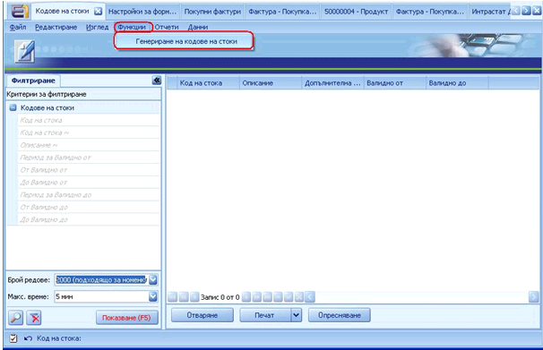
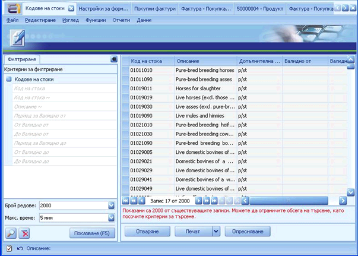
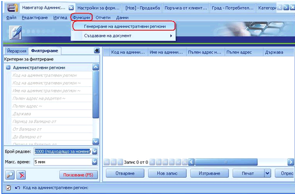
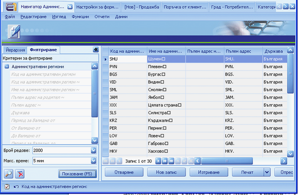

# Генериране на Интрастат кодове на  стоки и Административни региони

При първоначалната  настройка на модул **Интрастат**, е необходимо да се **генерират** **Интрастат кодове на стоки,**  които се ползват в дефиницията  за **Продукта**, а също така и **Административни Региони,** нужни за дефиницията на **Собствената фирма**. За целта:  

### **Генериране  на Интрастат кодове на стоки:**  

**Главно меню >> Финанси >>  Интрастат >> Кодове на стоки** 

От меню **Функции** изберете **„Генериране на кодове на  стоки”:**

След тази стъпка системата е генерирала  необходимите Интрастат кодове:

### **Генериране  на Административни Региони** 

**Главно меню >> Настройки >> Инструменти >> Административни региони**  

От меню **Функции** изберете **„Генериране на административни  региони”:**

След тази стъпка системата е генерирала списък с  Административни региони, които ще се ползват в дефиницията за Собствена  фирма:

