# Печат на документи на фискално устройство

I. Въвеждане на продажби

1. Въвеждането на продажби се прави от меню Клиенти / Продажби/ Навигатор Продажби се избира Създаване на Продажба от магазин.

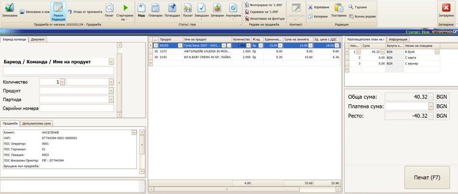

2. Автоматично се генерира УНП

3. Набират се продуктите в продажбата с помощта на баркод скенер или се избират от падащото меню.

4. В панел „Разплащателен план“ се отбелязват плащаните суми и съответните начини на плащане.

5. С бутон „Печат (F7)“ документа се отпечатва на фискален принтер и се приключва – статусът на документа преминава на Завършен

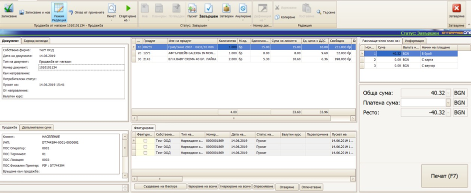

6. Ако се налага издаване на фактура, то в панел Фактуриране с бутон  „Маркиране на всички“ и „Създаване на фактура“ се създава фактура.

7. Избира се клиент, или се въвежда ако не е въведен. Сменя се статуса  на пуснат и се отпечатва фактурата от бутон „Печат“. След затваряне на  формата за фактура се връщаме отново във форма Продажба.

8. Нова продажба се започва от бутон „Записване и нов“

# II. Анулиране на продажба

Ако продажбата не е приключена и все още няма плащания по нея тя може да бъде анулирана.

1. Това се прави от бутон „Анулиране“ в меню „Начало“. Избира се „Анулиране с поддокументите, влючително пуснатите“

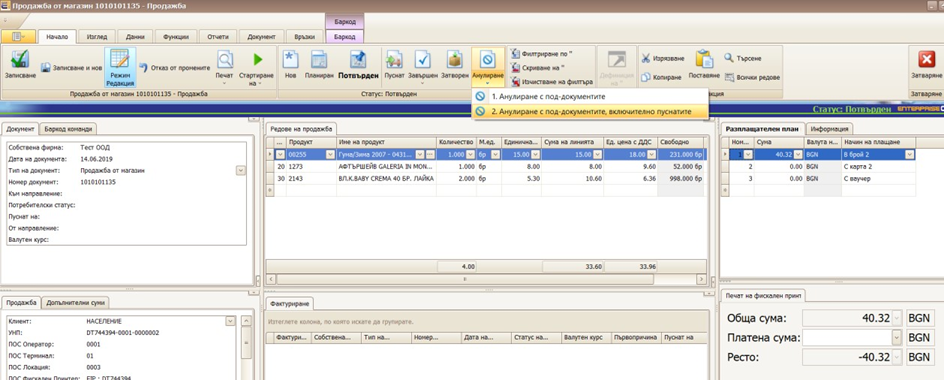

# III. Сторниране на продажба

Ако продажбата е завършена, то може да се направи сторнираща продажба – частично или пълно.

1. Въвеждането на сторнираща продажби се прави от меню Клиенти / Продажби/ Навигатор Продажби се избира Създаване на Връщане на стока

2. В отворената форма в поле „Връщане към продажба“ с десен бутон се избира „Избиране чрез навигатор“

3. В отворения навигатор се търси продажбата по която се връща по различни критерии, включително УНП

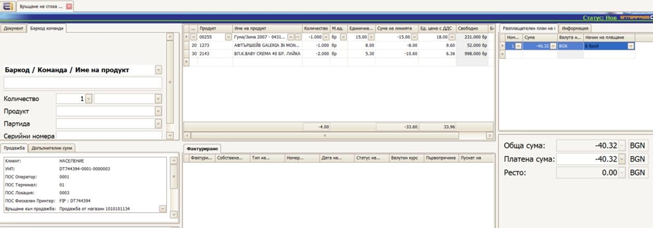

4. Автоматично се зареждат продуктите от оригиналната продажба с обратен знак

5. Коригират се количествата така, че да останат само реално връщаните продукти

6. С бутон „Печат (F7)“ документа се отпечатва на фискален принтер и се приключва – статусът на документа преминава на Завършен

7. Ако се налага издаване на кредитно известие, то в панел Фактуриране с бутон „Маркиране на всички“ и „Създаване на кредитно известие“ се  създава фактура.

# IV. Плащане на продажба на вноски

1. Въвеждането на продажби се прави от меню Клиенти / Продажби/  Навигатор Продажби се избира Създаване на „Продажба в брой с  разплащателен план“.

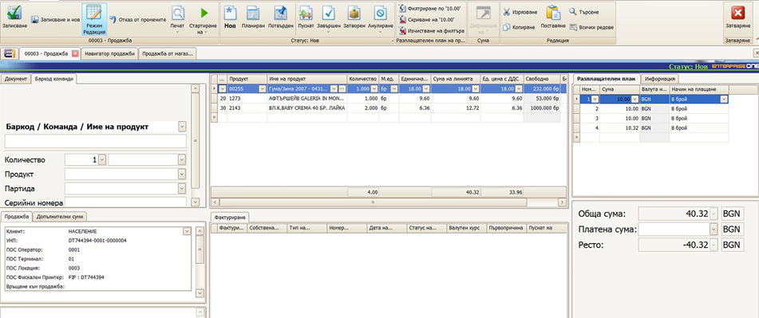

2. Автоматично се генерира УНП

3. Набират се продуктите в продажбата с помощта на баркод скенер или се избират от падащото меню.

4. В панел „Разплащателен план“ се отбелязват планираните вноски за плащане.

5. Сменя се статуса на документа на Пуснат

6. При постъпило плащане се отваря планираното плащане по тази продажба и през бутон „Печат (F7)“ се отпечатва на фискално устройство  плащането. Данните се взимат от свързаната с плащането продажба. Статуса на плащането се сменя на Завършен.

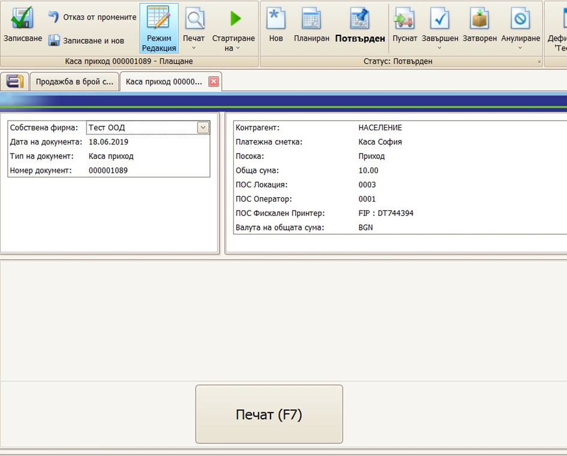

7. След като се направят всички плащания, статуса на продажбата се сменя на Завършен.

8. Ако се налага издаване на фактура, то в панел Фактуриране с бутон  „Маркиране на всички“ и „Създаване на фактура“ се създава фактура.

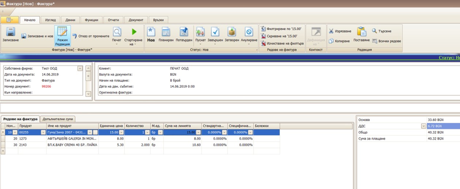

9. Избира се клиент, или се въвежда ако не е въведен. Сменя се статуса  на пуснат и се отпечатва фактурата от бутон „Печат“. След затваряне на  формата за фактура се връщаме отново във форма Продажба.

10. Нова продажба се започва от бутон „Записване и нов“

# V. Служебно въвеждане на пари в каса

1. От меню Финанси / Плащания се избира „Създаване на Служебно въвеждане на пари в каса“
2. Избира се контрагент лицето което внася парите
3. Избира се касата в която се внасят пари.
4. Избира се посока „Приход“
5. Попълва се сумата, която се внася.
6. Маха се отметката „Изисква разпределение“
7. Натиска се бутона „Печат (F7)“

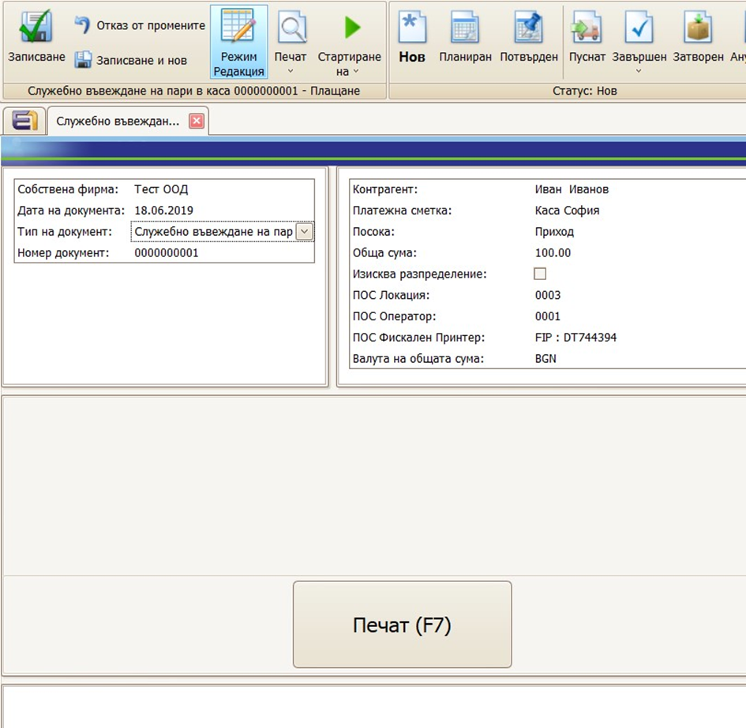

8. Статуса на плащането автоматично се сменя на Завършен.

# VI. Служебно извеждане на пари от каса

1. От меню Финанси / Плащания се избира „Създаване на Служебно извеждане на пари от каса“

2. Избира се контрагент лицето което внася парите

3. Избира се касата в която се внасят пари.

4. Избира се посока „Разход“

5. Попълва се сумата, която се внася.

6. Маха се отметката „Изисква разпределение“

7. Натиска се бутона „Печат (F7)“

8. Статуса на плащането автоматично се сменя на Завършен.

   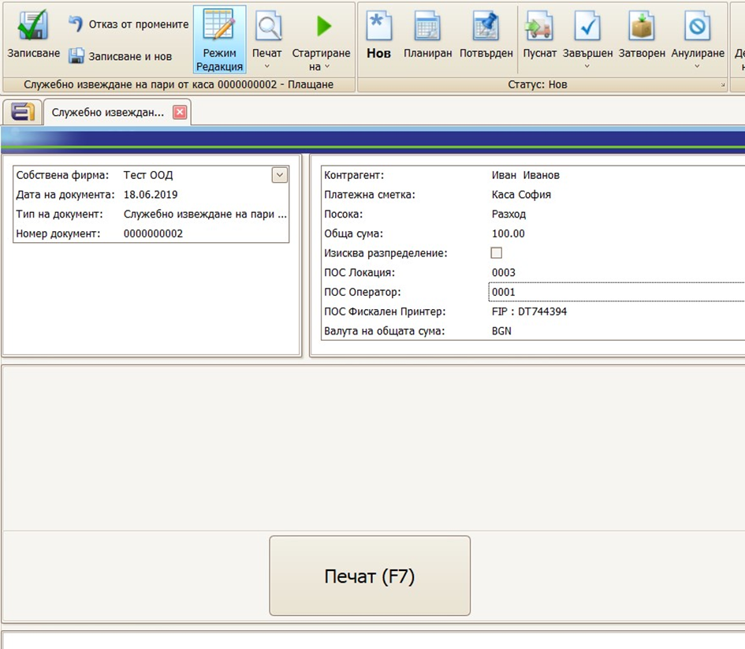

# VII. Масово назначаване на УНП за продажби 

1. Отваря се Навигатор продажби и се зареждат документите на които трябва да се назначи УНП.
2. Маркират се редовете на които трябва да се назначи УНП.
3. От меню Функции се избира Попълване на УНП.
4. УНП ще се попълни само в документите, където УНП е празно и статуса на документите е по малък от Пуснат.

# VIII. Настройка за групиран печат на фискален бон

1. Поведението се контролира от ключ „Crm/Pos/PrintGroupedSalesLinesType“ в Настройки / Инструменти / Конфигурации

https://docs.erp.net/tech/config-options-reference-178749455.html

- Ако ключът има стойност „ShortName“, то групирането се прави по поле „Кратко име“ в дефиницията на продукта.

Например, ако в продажбата има два продукта с еднакво „Кратко име“,  то те ще се отпечатат на един ред във фискалния бон с това кратко име и  сума и количество – сума на двата реда и сума на двете количества.

- Ако ключът има стойност „ProductGroup“, то групирането се прави по  името на продуктовата група, в която непосредствено се намира текущия  продукт.

Например ако в продажбата има два продукта в една и съща продуктова  група, то ще се опречата само един ред с името на продуктовата група и  сума и количество – сума на двата реда и сума на двете количества.

# IX. Печат на фискален бон по фактура

За да се отпечата съкратен фискален бон, който съдържа само Номер на  фактура и Дата на фактура е необходимо да се отпечата плащане, което е  по Фактура.

1. Отваря се фактурата, която трябва да се отпечата на ФУ
2. Създава се ново плащане по тази фактура – през връзки от платежното искане или през навигатор Статус на плащанията.
3. Това плащане се печати на фискален принтер с бутон Печат (F7)

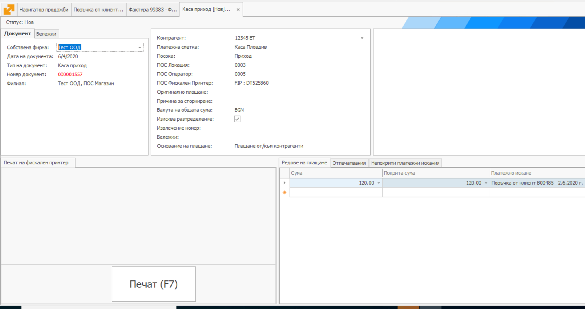

# X. Сторно „Операторска грешка“

За да се направи Сторно „Операторска грешка“ е необходимо да се сторнира направеното плащане без да се сторнира продажбата

1. Отваря се плащането по съответната продажба, което трябва да се сторнира

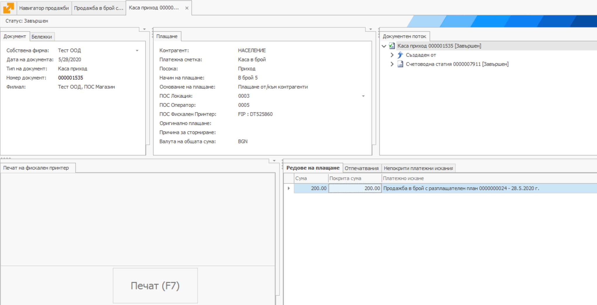

2. Създава се ново плащане което да реферира предходното чрез поле  „Оригинално плащане“. Например чрез функция „Нов на база на текущия“  документ

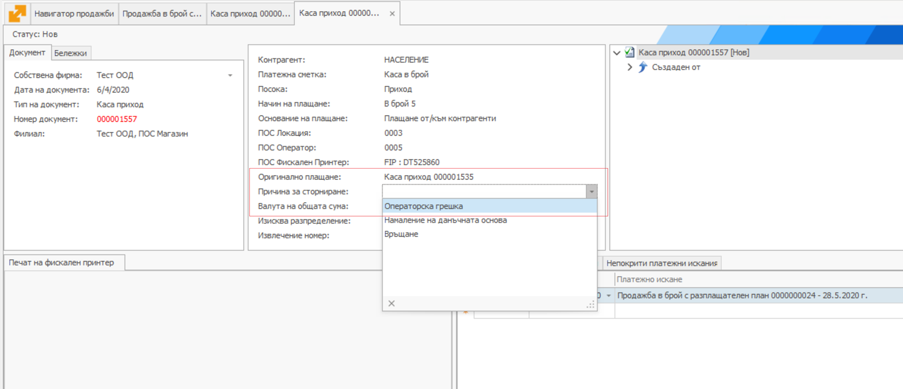

3. Избира се Причина за сторниране = „Операторска грешка“

4. Указва се сумата която се сторнира, както в „Обща сума“ така и в  редовете на плащането. Платежното искане в редовете на плащането трябва  да е същото, като това в оригиналното плащане.

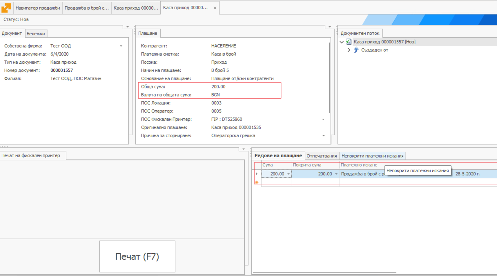

1. Плащането се печати през бутон Печат (F7)

Цитираните в това ръководство имена на типове документи, както и  стъпките на работа могат да се различават при различните имплементации  на ERP.net, тъй като са обект на настройка.