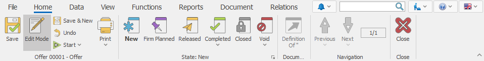
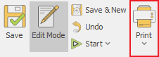
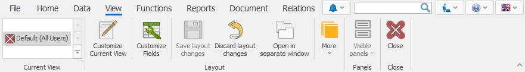
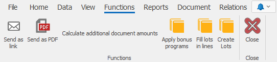

# Document command ribbon
The <b>command ribbon</b> in a document system form contains both the primary functions for all system forms and some commands that are specific for this type of a form.

## Home tab
Here is how the <b>Home</b> tab looks like:

 
It contains both the standard functionalities that are present in other system forms and some specific functions. 
-	An example of a specific function that is only available in the home tab is Start:

 -	An example of a function that you can find in other forms as well is Print:
 

Other features of the Home document page are:
-	<b>Save</b> – saves the entered information;
-	<b>Undo</b> – reverses the changes you’ve made so far (changes that you haven’t saved yet);
-	<b>Save & New</b> – saves the information in the current document and loads a new one;
-	<b>Edit Mode</b> – allows you to edit the data in the form;
-	<b>Print</b> – prints out the document;
-	<b>States</b> – shows the state of completion for the current document;
-	<b>Context menu</b> - displays a list of commands, related to a selected system form element. You can also open the context menu by right-clicking on the element.
The first component in the Context menu is the Definition of the selected element.
 

For example, when you click on the Customer field (in the Header of the Offer Document), the name of the selected item (in this case, the customer’s name) will appear in the context menu. This way, when selected, the context menu will show the definition form of the currently selected customer.
 

When the document is in a <b>New</b> state, this function provides the following opportunities:
1.	<b>Connect to Customer</b> – connects you to the customer with the data that is already entered in the program;
 

2.	<b>Select from navigator</b> – allows you to select a value for that field from the navigator;
3.	<b>More</b>:
-	<b>Create new for Customer</b> – create a record for the current field;
-	<b>Refresh display values (F9)</b> – refresh the values for the drop menu of the current field;
-	<b>Create form Internet</b> – automatically retrieves all the data for a given company from the Internet, by entering the VAT number. 
Choosing another field from the Header, which has a definition, will cause the elements of the context menu to change. For example, when clicking on the Document Type field in the Document panel.

## Data tab
The Data tab includes:
 

-	<b>Cut</b> – removes the selected text and temporarily copies it to the clipboard. It moves the data from their initial location to a new one. This function is most commonly used for corrections;
-	<b>Copy</b> – copies the selected text and temporarily copies it to the clipboard. This function allows you to easily type in the same data multiple times;
-	<b>Paste</b> – puts the text you just copied where you need it;
-	<b>Find</b> – searches for a word or a number in documents, navigators or reports.
Copy and Cut are useful when you want to save yourself the time to reapply the same data, and to avoid mistakes, while filling out the information. For example, through copying the names of people and companies, you save time by not typing them out, while eliminating the rick of mistakes.  
-	<b>Paste Top Cell</b> – you can use this function to quickly edit multiple records in a table panel. It applies the value of the top cell to the ones below it;
-	<b>Export to Excel</b> – available only for the Document Forms and the Navigators. Clicking on it will export all the selected rows to Excel. This function can only be used for tabular data. Therefore, it is available only in the navigators, reports or in the panels of a document form that contains information in tabular form (For example, Sales Order in the Sales Document)
-	<b>Calculator</b> – they do not carry new information and we don’t save their values in your database.  Those are fields with real-time calculated values (after opening the Form). They are used for working with already existing data with a set criterion, recalculating the data with a different formula.

## View tab
This tab contains tools for changing the appearance of the document. This includes showing/hiding shared panels common for all documents. 
 

-	<b>Current view</b> – shows the different types of views;
-	<b>Customize Current View</b> – allows you to edit system forms;
-	<b>Customize Fields</b> – serves for editing, showing and hiding the properties and settings of panels;
-	<b>Save layout changes</b> – saves the changes you’ve made on the view;
-	<b>Discard layout changes</b> – resets the view back to its initial look;
-	<b>Open in separate window</b> – opens the form in a separate window;
-	<b>More</b> – contains a set of functions related to saving and deleting a view, restoring it to its default state, as well as setting the access rights to certain views for a given user.
-	<b>Visible panels</b> – shows or hides panels in the view;
-	<b>Close</b> – closes the current Form;

In the Navigators, the View tab has another section for visual settings:
 

The additional functions of the Navigators are:
-	<b>Filter row</b> – shows a row, where you can set your search criteria;
-	<b>Freeze columns</b> – fixes a column that does not shift when scrolled horizontally. The columns in front of it also remain static.
 

This way you can overlap columns without changing up the View.
 

-	<b>Record Navigation</b> – shows and hides the navigation buttons from the lower left corner. You can use these buttons to scroll through consecutive records or pages.
-	<b>Cell Selection Mode</b> – allows you to switch between two modes. When this mode is deactivated, you will be selecting the entire rows in the Navigators. But if it’s active, you will be able to select single or multiple fields.  

## Functions tab
The <b>functions tab</b> of the document form has various functions for each type of Documents, depending on its application and in what module it is (invoice, purchase, sale, warehouse receipt, report…) Here are the two most common functions among the types of document forms:
-	<b>Send as link</b> – this function provides you with two methods to send an E-mail – sending via link or mailing the Document as a PDF format;
-	<b>Calculate additional document amounts</b> – this function calculates and distributes additional amounts throughout the rows in the Document.
 

 
## Reports tab
Here you can design views. The idea is to have a universal system for creating a printout for requests. It contains various templates for each table in the data source. 
When you open a navigator, a default value is set. So, when you enter through a navigator panel and create a new report, the query on that panel loads. 
Here is how the tab looks like:
 

## Document tab
 

The Document tab contains the following sub-menus and functions:
-	<b>Adjustment Documents</b> - shows you the list of corrected documents that were previously created for this document
-	<b>Versions</b> - shows the versions of a document before and after any changes or adjustments were made 
-	<b>Create New from Current</b> - creates a copy of the document. The new document will be with the current date, but it will also consist of the data in the original document
-	<b>Duplicate</b> - gives you the opportunity to create a duplicate of the original document which will have the status New and the opportunity to be changed. If you have a type of document that has a numerator, the duplicate creates a new number. 
-	<b>Create Adjustment</b> - gives you the opportunity to create an adjustment document.
-	<b>Create Adjustment to Zero</b> - allows you to create an adjustment document with values that resets all quantitative and fields of values

## Relations tab
In this tab, you can see generated, canceled or transit sub-documents (if any) for the current document. You will also find the sub-documents that you can manually create for this Document. 
 

