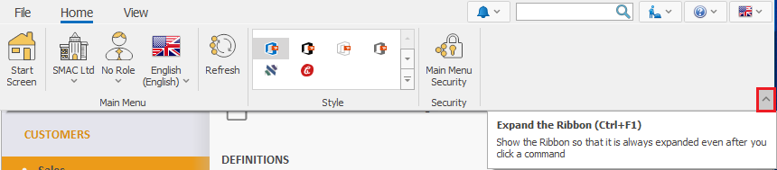

# Command ribbon 

The <b>Command ribbon</b> is a modern alternative to the classic menus. The actions in it are visualized through buttons. It is easy to use with a single tap or mouse click. 

The command ribbon contains two main pages - [Home](../introduction/workspace/main-menu.md) and [File](../introduction/workspace/file-page.md), which you can find in any system form.

What is special about the command ribbon in @@winclientfull is the adaptive context. The buttons change and provide specific functions, needed for the workflow you are currently working with. This way, you always see the exact buttons you need.

 

## Quick access toolbar

 You can add personalized buttons for quick access. This is an additional row, which contains fixed and always visible buttons. It is created by the user and therefore it is specific for every user and every company. You can add buttons from different tabs of the command ribbon in it by right-clicking on the desired button and selecting **Add to Quick Acces Toolbar**.

  
   
 

## Minimize the ribbon

The command ribbon has two main states - *minimized (compact)* and *expanded*. You can switch between them (minimize or expand it) from the button on the bottom right corner of the command ribbon:
 
 

Another way you can minimize the command ribbon is with right click on the **Customize Quick Access Toolbar** button. Choose the function <b>Minimize the Ribbon</b> there:

 

When the ribbon is in its compact state, you would see only the names of the pages. When click on some of the tabs the ribbon go back to its extended state, until you click on one of its buttons or click somewhere outside the ribbon:

 

## Expand the ribbon 

If you would like to expand your ribbon again, you can do it with the little button on the right:

 
