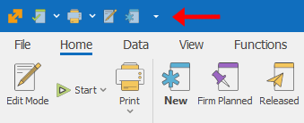

# Command ribbon 

The <b>command ribbon</b> is a modern alternative to the classic menus. The actions in it are visualized through buttons. It is easy to use with a single tap or mouse click. 

What is special about the command ribbon in @@winclientfull is its <b>adaptive context</b>. The buttons change and provide specific functions, needed for the workflow you are currently working with. This way, you always see the exact buttons you need.
 

The command ribbon contains two main pages - Home and File, which you can find in any system Form. You can also add personalized buttons for quick access. This is an additional row, which contains fixed and always visible buttons. It is created by the user and therefore it is specific for every user and every company. You can add buttons from different tabs of the Command Ribbon there.

      

The command ribbon has two main states - minimized (compact) and expanded. You can switch between them (minimize or expand it) from the button on the bottom right corner of the command ribbon:
 
 

Another way you can minimize the command ribbon is with right click on the Customize Quick Access Toolbar button. Choose the function <b>Minimize the ribbon</b> there:

 

When the ribbon is in its compact state, you would see only the names of the pages. When you hover over the ribbon, it would go back to its extended state, until you move away the cursor:

 
