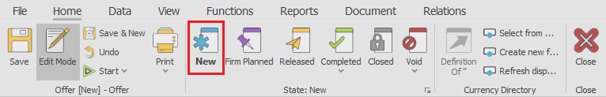
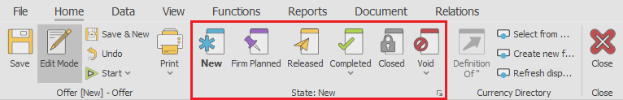
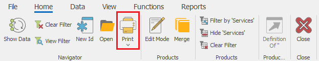
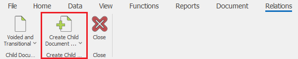
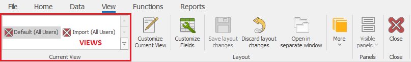
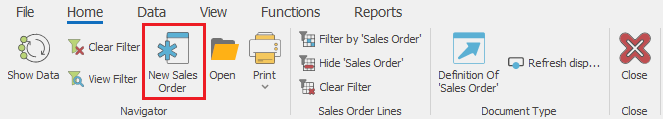
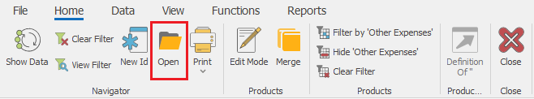
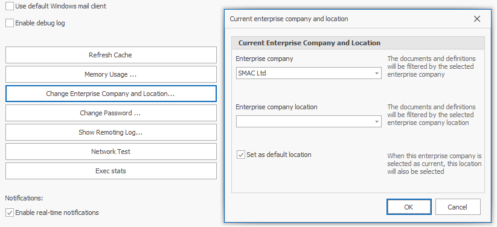
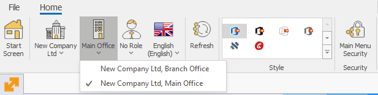
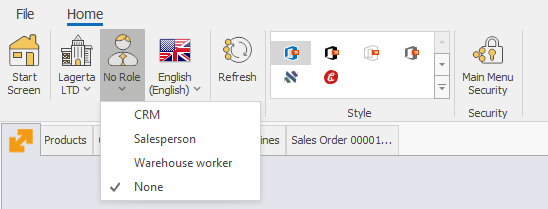

# Most commonly used commands

Here is a list of the most commonly used commands.

## Documents  

- Definition - opens the definition of the selected entity.

    
- New document - usually available in the document navigators, used to create new documents.

- Change a document state - the set of butttons with which you can change the document state to "Planned", "FirmPlanned", "Released" ... or void a document

Command Ribbon >> Home:

 
- Print - opens a print preview of the default Printout layout. The dropdown contains printing modes and a list with all availabe printout layouts for this record.

Command Ribbon >> Home:

 
- Create child document - used to manually create a sub-document i.e. the next document of the document flow. Opens a list with all available document types, which can be created from the current document, according to the preset document routes.

Command Ribbon >> Relations:

- Change View - used to change and  navigate between the available [Views](workspace-customization/working-with-views.md).

Command Ribbon >> View

## Navigators

- Show data - loads the data into the navigator, according to the specified filters into the filter panel.

Command Ribbon >> Home:
 

- Create new - used to create a new record of the particular entity.

Command Ribbon >> Home:

- Open document - opens the single form of the selected document.

Command Ribbon >> Home

## General

- Change Enterprise company - opens a drop down list with the Enterrise Companies available into the datatabase.

Main Menu >> Command Ribbon >> Home:

Or File menu >> Settings >> Change Enterprise company and location…

 
- Change location - used to change the Enteprise company in which you are currenly working. Contains a dropdown list with the Company locations of the selected Enterprise company.

Main Menu >> Command Ribbon >> Home:

 
- Change current role - opens a dropdown list with the roles available for the particular user

Main Menu >> Command Ribbon >> Home: 

- Change of style - used to change the visual style i.e. theme of the @@winclientfull

Main Menu >> Command Ribbon >> Home: 
 

