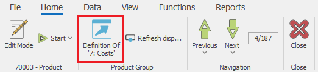
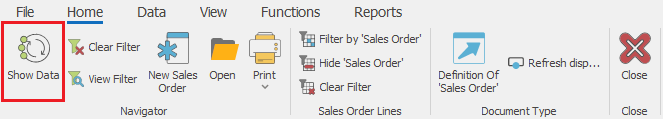
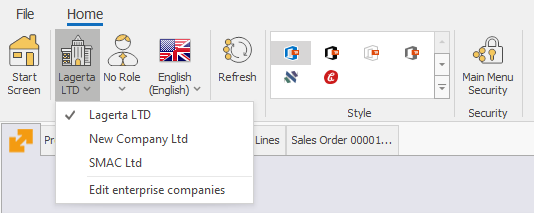

# Most commonly used commands

Here is a list of the most commonly used commands.

## Documents  

- **Definition** - opens the definition of the selected entity.

    
- **New document** - usually available in the document navigators, used to create new documents.

- **Change a document state** - the set of butttons with which you can change the document state to *Planned, FirmPlanned, Released* ... or void a document

**Command ribbon >> Home**:

 
- **Print** - opens a print preview of the default printout layout. The dropdown contains printing modes and a list with all availabe printout layouts for this record.

**Command ribbon >> Home**:

 
- **Create Child Document** - used to manually create a sub-document i.e. the next document of the document flow. Opens a list with all available document types, which can be created from the current document, according to the preset document routes.

**Command ribbon >> Relations**:

- **Change view** - used to change and  navigate between the available [views](https://docs.erp.net/winclient/introduction/workspace-customization/working-with-views.html?q=views).

**Command ribbon >> View**

## Navigators

- **Show Data** - loads the data into the navigator, according to the specified filters into the filter panel.

**Command ribbon >> Home**:
 

- **Create new** - used to create a new record of the particular entity.

**Command ribbon >> Home**:

- **Open document** - opens the single form of the selected document.

**Command ribbon >> Home**

## General

- **Change Enterprise company** - used to change the enteprise company in which you are currenly working. Opens a drop down list with the enterprise companies available into the datatabase.

**Main menu >> Command ribbon >> Home**:

Or **File menu >> Settings >> Change Enterprise Company and Location**…

 
- **Change location** - used to change the enteprise company location in which you are currenly working. Contains a dropdown list with the company locations of the selected enterprise company.

**Main menu >> Command ribbon >> Home**:

 
- **Change current role** - opens a dropdown list with the roles available for the particular user.

**Main menu >> Command ribbon >> Home**: 

- **Change of style** - used to change the visual style i.e. theme of the @@winclientfull

**Main menu >> Command ribbon >> Home**: 
 

