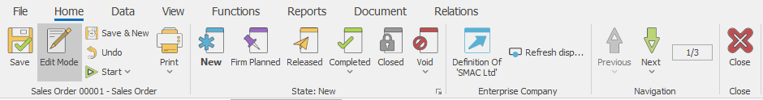
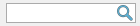
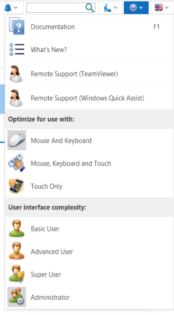
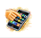
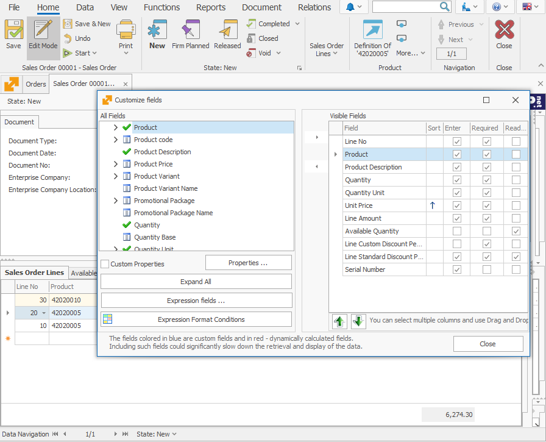

# Dashboard

The <b>Dashboard</b> shows the different system forms you will need when working with @@winclientfull.

See the ribbon on the top - it contains tabs with different commands (or buttons). Depending on what system Form is open (Document, Navigator/Reference or Definition) and what the positioning of the cursor is, the Command Ribbon will contain different pages with tools for managing the currently active Form.
 
 
 
Above the Command Ribbon, you can find additional tools that allow you to do quick search, open the user documentation, or choose the system language. 

## Quick access tool

 
In this field, you can search for Documents, Contractors, Products, and program menus in the current Enterprise company. Press Space and type a part of your searched text. You cannot search for voided documents. Limited number of relative matches will show up under the field (if your searched document exists, you will find it there).
 

 
## Help

The Help button opens the following menu:

The menu has 3 sections:

1. User help
-  <b>Documentation</b> - holds the user manual for working with @@winclientfull. Another way to access the documentation is the hotkey F1 on your keyboard.
-  <b>What’s New</b> - describes the new features of the system.
-  <b>Remote support</b> - access remote support through this icon.

2. System optimization
-  <b>Mouse and Keyboard</b> – choose when working with a computer.
-  <b>Mouse, Keyboard and Touch</b> – choose when working with touch devices that are connected with a mouse and a keyboard.
-  <b>Touch Only</b> – choose with touchscreen devices, like smartphones or tablets. The higher access rights, the more options for working with the system.  

3. Interface complexity – every user has preset access rights. A user with higher privilege can ease his work by choosing a user with a lower one (for example Super User can choose to see the functionalities in the system as a Basic User). The options from sections <b>Optimize for use</b> and <b>User interface complexity</b> can be accessed through the File menu >> Settings.

## Language

 Choose the language for the system by clicking on this icon.
English and Bulgarian are there by default, but the program allows you to add multiple other languages as well.

### System forms

You can open more than one system form on the dashboard:

