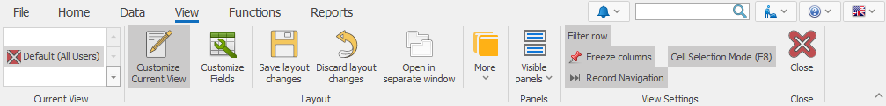
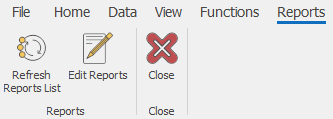

# Document command ribbon
The <b>command ribbon</b> in a document system form contains both the primary functions for all system forms and some commands that are specific for this type of a form.

## Home tab
Here is how the <b>Home</b> tab looks like:

 
It contains both the standard functionalities that are present in other system forms and some specific functions. 
-	An example of a specific function that is only available in the Home tab is Start:

 
-	An example of a function that you can find in other forms as well is Print:
 

Other features of the Home document page are:
-	<b>Save</b> – saves the entered information;
-	<b>Undo</b> – reverses the changes you have made so far (changes that you have not saved yet);
-	<b>Save & New</b> – saves the information in the current document and loads a new one;
-	<b>Edit mode</b> – allows you to edit the data in the form;
-	<b>Print</b> – prints out the document;
-	<b>States</b> – shows the state of completion for the current document;
-	<b>Context menu</b> - displays a list of commands, related to a selected system form element. You can also open the context menu by right-clicking on the element.
The first component in the Context menu is the Definition of the selected element.
 

**For example**, when you click on the *Customer* field (in the header of the Offer document), the name of the selected item (in this case, the customer’s name) will appear in the context menu. This way, when selected, the context menu will show the definition form of the currently selected customer.
 

When the document is in a **New**, **Planned** or **Firm Planned** state, this function provides the following opportunities:
1.	<b>Connect to customer</b> – connects you to the customer with the data that is already entered in the program;
 

2.	<b>Select from navigator</b> – allows you to select a value for that field from the navigator;
3.	<b>More</b>:
-	<b>Create new for customer</b> – create a new record for the current field;
-	<b>Refresh display values (F9)</b> – refresh the values for the drop menu of the current field;
-	<b>Create from Internet</b> – automatically retrieves all the data for a given company from the Internet, by entering the VAT number.
 
Choosing another field from the header, which has a definition, will cause the elements of the context menu to change. **For example**, when clicking on the *Document Type* field in the **Document** panel.

## Data tab
The **Data** tab includes:
 

-	<b>Cut</b> – removes the selected text and temporarily stores it in the clipboard. It moves the data from their initial location to a new one. This function is most commonly used for corrections;
-	<b>Copy</b> – copies the selected text and temporarily stores it in the clipboard. This function allows you to easily type in the same data multiple times;
-	<b>Paste</b> – puts the text you just copied where you need it;
-	<b>Find</b> – searches for a word or a number in documents, navigators or reports.

Copy and Cut are useful when you want to save yourself the time to reapply the same data, and to avoid mistakes, while filling out the information. **For example**, through copying the names of people and companies, you save time by not typing them out, while eliminating the rick of mistakes.  
-	<b>Paste Top Cell</b> – you can use this function to quickly edit multiple records in a table panel. It applies the value of the top cell to the ones below it;
-	<b>Export to Excel</b> – clicking on it will export all the selected rows to Excel. 
This function can only be used for tabular data. Therefore, it is available only in the navigators, reports or in the panels of a document form that contains information in tabular form (**For example**, Sales Order Lines panel in the Sales Order)
-	<b>Expression fields</b> – clicking on it will open a window that contains all the expression fields available for the selected panel /if any exists/. Then you are able to enter new ones or to delete some of them. Expression fields are fields with real-time calculated values (after opening the form) and their values are not saved into the database. They are used for processing already existing data by recalculating them via different formulas.

## View tab
The **View** tab contains tools for changing the appearance of the document. This includes showing/hiding shared panels common for all documents. 
 

-	<b>Current view</b> – shows the different types of views;
-	<b>Customize Current View</b> – allows you to edit system forms;
-	<b>Customize Fields</b> – serves for editing, showing, hiding, managing properties and settings of the fields in a particular panel;
-	<b>Save layout changes</b> – saves the changes you have made on the view;
-	<b>Discard layout changes</b> – resets the view back to its initial look;
-	<b>Open in separate window</b> – opens the form in a separate window;
-	<b>More</b> – contains a set of functions related to saving and deleting a view,  restoring it to its default state, as well as setting the access rights to certain views for a given user;
-	<b>Visible panels</b> – shows or hides panels in the view;
-	<b>Close</b> – closes the current form.

In the navigators, the **View** tab has another section for visual settings:
 

The additional functions in the navigators are:
-	<b>Filter row</b> – shows a row, where you can set your search criteria;
-	<b>Freeze columns</b> – fixes a column that does not shift when scrolled horizontally. The columns in front of it also remain static.
 

This way you can overlap columns without changing up the view:
 

-	<b>Record Navigation</b> – shows and hides the navigation buttons from the lower left corner. You can use these buttons to scroll through consecutive records or pages.
-	<b>Cell Selection Mode</b> – allows you to switch between two modes. When this mode is deactivated, you will be selecting the entire rows in the navigator. But if it is active, you will be able to select single or multiple fields.  

## Functions tab
The **Functions** tab of the document form has various functions for each type of documents, depending on its application and in what module it is located (Invoice, Receiving Order, Sales Order, Store Transaction, Vaucher, etc.). Here are the two most common functions:
-	<b>Send as link</b> and **Send as PDF format** – these functions provides you with two methods to send the document via E-mail – sending it as link or as a PDF file;
-	<b>Calculate additional document amounts</b> – this function calculates and distributes additional amounts throughout the rows in the document.
 

 
## Reports tab
Here you can design views. The idea is to have a universal system for creating a printout for a query. It contains various templates for each table in the data source.

When you open a navigator, a default value is set. So, when you enter through a navigator panel and create a new report, the query on that panel loads.

Here is how the tab looks like:
 

## Document tab
 

The Document tab contains the following sub-menus and functions:
-	<b>Adjustment Documents</b> - shows you the list of adjusted documents that were previously created for this document;
-	<b>Versions</b> - shows the versions of a document before and after any changes or adjustments were made; 
-	<b>Create New from Current</b> - creates a copy of the document. The new document will be with the current date, but it will contain the same data as in the original document;
-	<b>Duplicate</b> - gives you the opportunity to create a duplicate of the original document which will have the status New and the opportunity to be changed. If you have a type of document that has a numerator, the duplicate creates a new number; 
-	<b>Create Adjustment</b> - gives you the opportunity to create an adjustment document;
-	<b>Create Adjustment to Zero</b> - allows you to create an adjustment document with values that resets all quantitative and value fields.

## Relations tab
In this tab, you can see generated, voided or transit sub-documents (if any) for the current document. You will also find the sub-documents that you can manually create for this document. 
 

