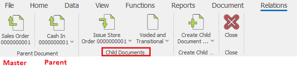
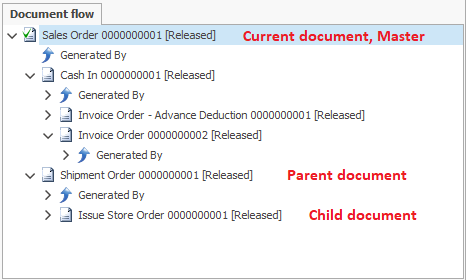

# Document flow

<b>The document flow</b> describes the hierarchy of a given process - the order in which you create the documents. It has only one document for a <b>start – the master document</b>, and a variety of child documents that you create from the master document. According to its place in the document flow (and the current document), you can set almost every document to be a master, parent or child document.

## Master document 

The master document is a document that initiates a given process. It is an absolute category, and it does not depend on the current document. It is not created by other documents (it does not have a parent document). The master document is only one for every process.

## Parent document 

Parent document is a document that you can use to create another document. It is a relative category, and it depends on the current document. You can use the parent document as a child document for another document. The documents usually have only one parent document. It is possible for you to connect one document to other documents in the document flow, but these documents will not be real parent documents. The master document is a parent document for the documents that you have created right under its level.  
For example: in the document route A > B > C, A is the parent for B, B is the parent of C.

## Child documents 

Child documents are documents that you create from another document. It is a relative category and these documents depend on the current document. Documents might have a variety of child documents. The child document can be a parent document for another document.  
For example: In the document route A > B > C, B is a child document of A, C is a child document of B. B can also be seen as the parent document of C.

## Relations menu in the command ribbon 

You can also see the hierarchy of documents not only in the document flow but also in the relations menu in the command ribbon. We have optimized it for work with touch and to provide quick access to the documents in the flow.
  

The master document is at the far left part of the command ribbon - we have separated it from the rest with an arrow. The parent document is right after the master document. We have marked the master and parent document with an arrow pointing upwards. The child documents are at the right part of the separation line after the parent document. We have marked the child documents’ icons with an arrow pointing downwards. 
You can move to a more distant branch of the structure (child document of a child document or a parent document of a parent document) by clicking on the lower part (the name and arrow next to it). A list of the child documents will display (or of the parent documents respectively). This way, you can look through the entire tree.

## Document flow
You can view the document flow in the document flow panel. The panel is standard for all document types. It consists of a tree structure of all the documents, starting with the current one.

 
To open a document from the Document flow, right-click on the desired document and select “Open document”. When you right-click on a document you can also:

-	Show Void Documents – if you select that, the voided documents will display as well;
-	Show Transitional Documents - if you check that option, the transitional documents will display as well;
-	Refresh – refreshes the document flow.

The structure of the document flow begins from the current document. Under every document, you can see its child documents. In order to see the parent document, you have to press the expand button in front of “Created By”. The master document is the document that does not have an expand button in front of “Created By”. The document flow panel is convenient for a quick overview of the document flow.
