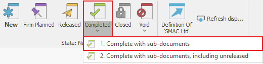

# Document state

<b>Document state</b> is a system characteristic that shows you at what stage of completion your document is. The document state has a business meaning, as well as a specific to the program meaning. The additional business meaning can come from the user state. The document system state can be:

-	<b>New</b> - every new manually created document initially has a new state. This document acts as a <b>draft</b> and traditionally no actions will be initiated by the program for it;
-	<b>Firm Planned</b> - this is a document, usually automatically created by the system, which usually needs additional processing. Such documents show <b>events with a possible, but uncertain nature</b>. You can use the documents with the firm planned state in the planning subsystem of @@winclientfull. The system will delete these documents after they are planned;
-	<b>Confirmed</b> - this is a document, confirmed by an authorized user of the system. It has a <b>probable</b> nature. The confirmed documents reflect the <b>intention for a future</b> release of the document. This is taken into consideration by the system and it <b>does not</b> delete them after they are planned;
-	<b>Released</b> - a document that is released for execution. The released state has a specific meaning in the system. It notes that the document has gained its <b>final</b> form and the system <b>forbids</b> any edits, including changing its state to a lower one. You can use the released state to start a sequence of system actions. This allows you to create sub-documents; 
-	<b>Completed</b> - this shows the completion of the active work on the document;
-	<b>Closed</b> - this allows you to see the completion of the entire work on a specific document (process). By using the closed state, you can optimize the speed of your work by selecting to work only with the open documents in the system;
-	<b>Adjustment</b> - you can only use this state for a document that is an adjustment of another one. By selecting this state, you put the adjustment document into action;
-	<b>Void</b>.

## Changing state

You can change the state of a document from the <b>Command Ribbon >> Home</b> by clicking on the desired state.
	

 
If you need to change the document’s user state, click on the arrow under the appropriate state and choose the desired option.

 
## Voiding

@@winclientfull has proven its security and reliability as a system. We do not allow information loss of any form. Part of this concept is the <b>inability to delete documents</b> irreversibly and completely. When necessary, you can void a document. This will save a copy in the database, but it won’t display is the Definitions (unless you specify that you need to see those copies).

Void has three variations – Void (only the current document); Void with sub-documents (if their state is lower than released); Void with sub-documents, including released. The necessity for those variations comes from safety precautions. If a given user can void any document, this may affect the work of other departments (warehouse, finance, accounting). Users can only void documents they have rights to. Users are not able to void sub-documents without having those rights. 
	
When you select to void a document, the system will open a new window first, asking for the reason for voiding this document:

If the system does not allow voiding a document, the likely reasons are:  
-	The user does not have the right to void a document. The solution to this problem is giving that user the required rights or making another user execute the voiding operation.  
-	Branched flow - it is possible that the document connects to other sub-documents indirectly. In this situation, you need to void the connected sub-documents first (for example, those branches result from selling products through the Navigator). 

## Completing

Completed – this State marks the completion of the document. You cannot set the document’s state to completed if any of its sub-documents are in a state lower than released. This preventive function serves as protection. By default, completed documents will not be visible in the Navigators, unless you specifically set them to display in the reports. 

The Completion has three variations – <b>Complete</b>  (only for the current document), <b>Complete with sub-documents</b>  (if the sub-documens are in a state <b>not</b> lower than released), <b>Complete with sub-documents, including unreleased</b>. The necessity for those variations comes from safety precautions. If a user has the right to complete documents from the flow, this can affect the work of other departments (warehouse, finances, accounting). Users can only complete the documents that they have the right to. They cannot complete sub-documents that they do not have the rights to. 
When a given user tries to <b>complete</b> a document, the system will automatically stop this process if there is a conflict, such as unfinished sub-documents. When you are completing the current document, the system will check whether you have completed the sub-documents (they have released state). If you have completed them and the user has the required rights, then the process is going to be ready for completion. If they are not, you will see an error and you have to clear it (complete the sub-document) in order to complete the current document.
