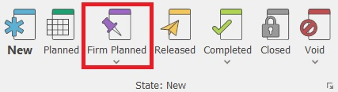

# Document state

<b>Document state</b> is a system characteristic that shows you at what stage of completion your document is. The document state has a business meaning, as well as a specific to the program meaning. Additional business meaning can be set via the user statuses. The document system state can be:

-	<b>New</b> - every new manually created document initially has a New state. This document acts as a <b>draft</b> and traditionally no actions will be initiated by the program for it;
-	<b>Firm Planned</b> - this is a document, usually automatically created by the system, which needs additional processing. Such documents show <b>events with a possible, but uncertain nature</b>. The documents with the Firm Planned state is used by the planning subsystem of @@winclientfull. When re-planning, the system will delete these documents. They cannot be deleted if no numerator is applied - in this case, they will be voided;
-	<b>Confirmed</b> - this is a document, confirmed by an authorized user of the system. It has a <b>probable</b> nature. The confirmed documents reflect the <b>intention for a future</b> release of the document. This is taken into consideration by the planning system and the confirmed documents <b>will not</b> be deleted when re-planning;
-	<b>Released</b> - a document that is released for execution. The Released state has a specific meaning in the system. It notes that the document has gained its <b>final</b> form and the system <b>forbids</b> any edits, including changing its state to a lower one. Usually, the Released state starts a sequence of system actions. This allows you to create sub-documents; 
-	<b>Completed</b> - this shows the completion of the active work on the document;
-	<b>Closed</b> - this shows the completion of the entire work on a specific document (process). By using the Closed state, you can optimize the speed of your work by working only with the open documents in the system;
-	<b>Adjustment</b> - you can only use this state for a document that is an adjustment of another one. By selecting this state, you put the adjustment document into action;
-	<b>Void</b>.

## Changing state

You can change the state of a document from the <b>command ribbon >> Home tab</b> by clicking on the desired state.
	

 
If you need to set or change the document’s user status, click on the arrow under the appropriate system state and choose the desired option.

When choosing a state (including the current one), the execution of the document routes is activated. 
The state **cannot** be changed in the following cases: 
- From Released state to a lower one (New, Firm Planned, Confirmed); 
- From Void state to no other; 
- From Adjustment state to no other, excluding Void state; 
- In case of a lower state of the sub-documents (e.g., the state of the Sales Order cannot be changed to Completed, if the Store Order's state is Released); 
- In some cases when the document flow is being branched.

 
## Voiding

@@winclientfull has proven its security and reliability as a system. Information loss of any form is not allowed. Part of this concept is the <b>inability to delete documents</b> irreversibly and completely. When necessary, you can void a document. This will save a copy in the database, but it won’t display is the reports (unless you specify that you need to see those copies).

Void has three variations – Void (only the current document); Void with sub-documents (if their state is lower than released); Void with sub-documents, including released. The necessity for those variations comes from safety precautions. If a given user has the right to void any documents from the flow, this may affect the work of other departments (warehouse, finance, accounting). Users can only void the documents they have rights to. They are not able to void sub-documents without having rights to them. 
	
When you select to void a document, the system will open a new window first, asking for the reason for voiding this document:

If the system does not allow voiding a document, the likely reasons are:  
-	The user does not have the right to void a document. The solution to this problem is giving that user the required rights or making another user execute the voiding operation.  
-	Branched flow - it is possible that the document connects to other documents indirectly. In this situation, you need to void the connected documents first (for example, those branches occur when selling goods, using execution navigators, etc.). 

## Completing

Completed – this state marks the completion of the document. You cannot set the document state to Completed if any of its sub-documents are in a state lower than released. This preventive function serves as protection. By default, completed documents will not be visible in the navigators, unless you specifically set them to be displayed.  

The Completion has three variations – <b>Complete</b>  (only for the current document), <b>Complete with sub-documents</b>  (if the sub-documents are in a state <b>not</b> lower than released), <b>Complete with sub-documents, including unreleased</b>. The necessity for those variations comes from safety precautions. If a user has the right to complete any documents from the flow, this can affect the work of other departments (warehouse, finances, accounting). Users can only complete the documents that they have the right to. They are not able to complete sub-documents without having rights to them. 

When a given user tries to <b>complete</b> a document with sub-documents, the system will automatically stop this process if there is a conflict, such as uncompleted or unreleased sub-documents. If you have released them and the user has the required rights, then the process is going to be ready for completion. If they are not, you will see an error and you have to clear it (realese or complete the sub-documents) in order to complete the current document.
