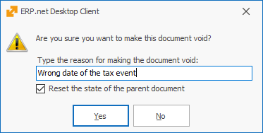

# Document state
The documents in the system have a current STATE. This state determines the effect on the system and whether the document can be updated. The allowed states of the document are **New, Planned, Firm Planned, Released, Completed, Closed and Adjusment**. For more information on the system and business logic of document states, see the [Document states](xref: states) topic in the Tech documentation.

## Document State Changing

You can change the state of a document from the <b>command ribbon >> Home tab</b> by clicking on the desired state.
	

 
If you need to set or change the document’s user status, click on the arrow under the appropriate system state and choose the desired option.

When choosing a state (including the current one), the execution of the document routes is activated. 
The state **cannot** be changed in the following cases: 
- From Released state to a lower one (New, Firm Planned, Confirmed); 
- In case of a lower state of the sub-documents (e.g., the state of the Sales Order cannot be changed to Completed, if the Store Order's state is Released); 
- When the document is and Adjustment to another document (its state is Adjustment)  
- When the document is Voided.
- In some cases when the document flow is being branched.

## Voiding

@@winclientfull has proven its security and reliability as a system. Information loss of any form is not allowed. Part of this concept is the <b>inability to delete documents</b> irreversibly and completely. When necessary, you can void a document. This will save a copy in the database, but it won’t display in the reports (unless you specify that you need to see those copies).

Void has three variations 
– **Void** (only the current document);
- **Void with sub-documents** (if their state is lower than released); 
- **Void with sub-documents, including released**. 
The necessity for those variations comes from safety precautions. If a given user has the right to void any documents from the flow, this may affect the work of other departments (warehouse, finance, accounting). Users can only void the documents they have rights to. They are not able to void sub-documents without having rights to them. 
	
When you select to void a document, the system will open a new window first, asking for the reason for voiding this document:

If the system does not allow voiding a document, the likely reasons are:  
-	The user does not have the right to void documents. The solution to this problem is giving that user the required rights or making another user execute the voiding operation.  
-	Branched flow - it is possible that the document connects to other documents indirectly. In this situation, you need to void the connected documents first (for example, those branches occur when selling goods, using execution navigators, etc.). 

## Completing

Completed – this state marks the completion of the document. By default, completed documents will not be visible in the navigators, unless you specifically set them to be displayed.  

The Completion has three variations – <b>Complete</b>  (only for the current document), <b>Complete with sub-documents</b>  (if the sub-documents are in a state <b>not</b> lower than released), <b>Complete with sub-documents, including unreleased</b>. The necessity for those variations comes from safety precautions. If a user has the right to complete any documents from the flow, this can affect the work of other departments (warehouse, finances, accounting). Users can only complete the documents that they have the right to. They are not able to complete sub-documents without having rights to them. 

When a given user tries to <b>complete</b> a document with sub-documents, the system will automatically stop this process if there is a conflict, such as unreleased sub-documents. The system will check whether you have completed the sub-documents (they must have Released state at least). If you have released/completed them and the user has the required rights, then the process is going to be ready for completion. If they are not, you will see an error and you have to clear it (release the sub-documents) in order to complete the current document.
