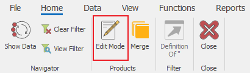

# Edit Mode

There is a big difference between the <b>Change Current View</b> mode and the <b>Edit Mode</b>. The Change Current View mode is used to set the way Forms appear, while Edit Mode is about the information (data). Activating the Edit Mode allows you to edit that information. The two modes are not interconnected. You have separate access for them so that Change Current View mode could be off while Edit Mode is on or vice versa (furthermore, both modes could be active or not). 

By default, Documents open with active Edit Mode, while Navigators and Definitions open with the mode deactivated. You can set all Forms to open with active Edit Mode automatically, if needed. You need Edit Mode to be active to change the information in the Forms. You can activate or deactivate the mode in the <b>Command Ribbon >> Home >> Edit Mode</b> (or with hotkey <b>F2</b>).

Note that not all Navigators have Edit Mode (Sales, Invoices, etc.).

 
