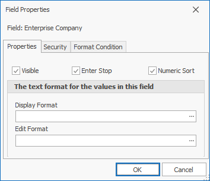

# Customize fields
Use the <b>customize fields</b> form to edit fields, hide them or make them visible, or customize their settings in a certain form panel.

Open the form with the  button in the <b>View</b> tab of the command ribbon for the current form or by right-clicking on the panel which will open a context menu.

The fields that appear in the form are located on the right side.

Reposition the fields around the form in the desired order with the Up  and Down buttons.

Click the  button to close the <b>customize fields</b> form. 

All the fields that are present in a certain panel are shown on the left side.

The tick  shows the fields, displayed in the panel when the form opens.

 shows the fields that are not displayed. 

The  button opens the <b>expression fields</b> form.

The  opens all the groups and shows the existing fields.

<b>Example</b> : 
The fields ‘Enterprise company ‘ and ‘Enterprise Company Location‘ are to expand with the use of this form without having to click on the menu displaying them.

Open <b>Field Properties</b> by clicking the  button.

  

The ‘Visible’ checkbox shows whether the field is visible for the current form.
The ‘Enter stop’ shows whether the cursor stops in the field after pressing ’enter’ or it would reposition to the next field.

The text formats for the values in this field are:

## <b>Display format</b>
Shows how the field displays into the form.
Click the    button to open the <b>String format</b>. 

 
The 'Category' section on the left has the unit categories for the field such as ‘currency’ or ‘percentage’.

The left part is separated into three panels – <b>Sample</b>, <b>Standard Types</b> and <b>Custom</b>:

- <b>Sample</b> - the visual representation of what is going to be inside the field
- <b>Standard Types</b> - Encoded unit standards for the settings. The content of <b>Sample</b> will change right after clicking on the standard type of choice.
- <b>Custom</b> - types set by the customer. Used the same way as the <b>Standard</b>. 

<b>Example</b>:
A number is typed out with three digits after the decimal separator. It must be displayed with 2 symbols only.
Open <b>String format</b>. Select the 'Number' category.
Select 'n2' Standard Type.
Click 'OK'.

## <b>Edit format</b>
Displays the editing format and what will be seen when the field is clicked upon.
Click on the  button to open the <b>String format</b> form.

 <b>Example</b>:
A number is typed out with 2 digits after the decimal separator. It must be displayed with 3 symbols only after the change in the field. 
Open <b>String format</b>. Select ‘Number’ category. Select ‘n3’ Standard Type, then click ‘OK’.
The number in the field has two digits after the separator. However, when clicked upon, it comes out as 3 symbols long.
