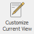
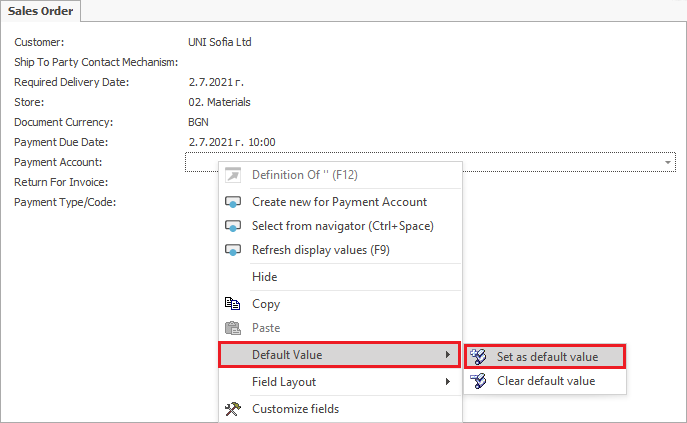
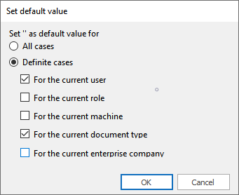
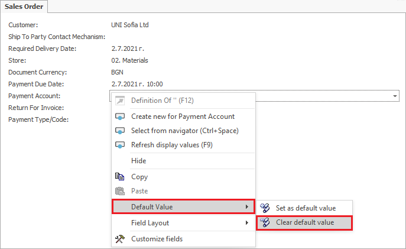
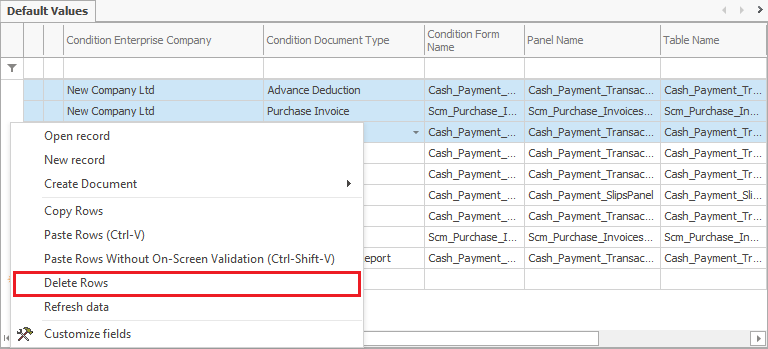

# Default values management

The <b>Set as default value</b> function is used to avoid repeated entering of data for similar objects.

To pick a default value, go to the field of choice, right-click it and from the context menu, select the function 

<b>Default value→ Set as default value</b>.

> Note: 
> the default value function requires enabled *Customize Current View* mode.

  

 

 The **Set default value** form opens. It displays a set of options and sub-options to choose from. 

   

Press **OK** to save the selected options. 

**Example 1:**

You want to set *Bank transfer* as default payment option in a **sales order** document. 

- Select the following: ***for the current user*** and ***for the current document type***. 

Any time you open a new **sales order** document, the *Bank transfer* value will automatically appear in the *Payment type* field. 

The <b>Clear default value</b> function clears the data set as default. 

- To use that functionality, go to the field of choice, right-click it and select <b>Clear default value</b> from the menu.

  

The <b>Default Values</b> navigator opens up. Another way to open it is through: <b>Main menu→Setup→Tools→Field Default Values</b>
 
Mark the row in the panel with a mouse click, then right-click and select the <b>Delete Rows</b> function.

**Example 2:**

The default value that you set – *Bank transfer*, in the *Payment type* field of the **sales order** document, needs to be cleared. 

After clearing the default value following the steps above, if you open a **sales order** document, *Payment type* will be empty.
