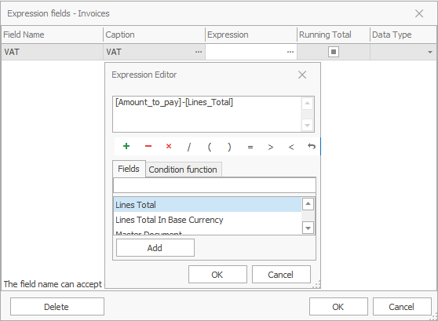
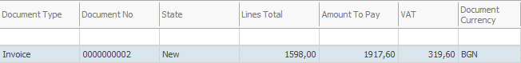

# Expression fields

<b>Expression fields</b> are created by the customer in the database. You can use them to generate formulas and create new fields where the formula calculations are applied. The formula <b>cannot</b> include values from other expression fields.

 
Open the expression fields form from: <b>Data→Expression fields</b>

  

**Example**:

- <b>Field name</b>: VAT
- <b>Title</b>: VAT
- <b>Formula</b>: press the   button

A <b>formula editor</b> opens. It is separated into three regions – the first one shows the formula; the middle one – various actions than can be executed; the last one is a fields panel where the fields included in the formula can be selected.

**Example**:

- select <b>Amount to pay</b>
- select the ‘<b>-</b>’ symbol
- select <b>Lines total</b>

The value in the new field will be summed by the formula: <b>Amount to pay</b> – <b>Lines total</b> = <b>VAT</b> field

Click <b>OK</b> to close the <b>Expression editor</b> or the <b>Expression fields </b> form. 

The <b>VAT</b> field shows up in the data panel.

  
