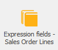

# Expression fields

<b>Expression fields</b> are created by the customer in the database. You can use them to generate formulas and create new fields where the formula calculations are applied. 
The formula can include values from other expression fields. In this case, the expression fields which are included should also be shown in the view and its position have to precede the expression field in whose formula they participate in.

 
Open the expression fields form from: <b>Data→Expression fields</b>

  

**Example**:

- <b>Field name</b>: VAT
- <b>Title</b>: VAT
- <b>Formula</b>: press the   button

A <b>formula editor</b> opens. It is separated into three regions – the first one shows the formula; the middle one – is a quick acces toolbar for adding symbols into the formula; the last one is a fields panel where can be selected the fields which can be included to the formula.

**Example**:

- select <b>Amount To Pay</b>
- select the ‘<b>-</b>’ symbol
- select <b>Lines Total</b>

The value in the new field will be summed by the formula: <b>[Amount_To_Pay]</b> – <b>[Lines_Total]</b> = <b>VAT</b> field

Click <b>OK</b> to close the <b>Expression editor</b> or the <b>Expression fields </b> form. 

The <b>VAT</b> field shows up in the data panel.

  
