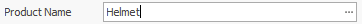
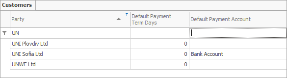
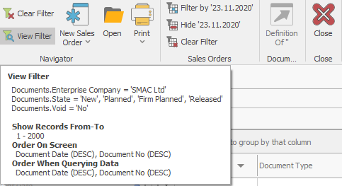
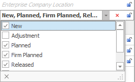

# Field types
## Text field

This is a field displaying text that can be entered and edited by the customer.

  

## Long text field
This is a field with a drop-down window, where longer text is displayed. The text can be entered and edited by the customer. 
 

## Drop-down list field
The field contains a drop-down list of predefined values, amongst which the customer can choose. It is not possible to enter values that are not included in the list.

  

There are three ways to search amongst the values this type of field displays:

- using the scrollbar located on the right side of the list. Preferable when the list is short.

- by typing the first letters of the text. The system will show all the values with names starting that way.  

- by entering a ‘space’ before a word the value has in its name. The ‘space’ would replace an indefinite number of symbols. Thus, the system would locate those values no matter where the word typed in the bar stands in the name. Take, as an example the ‘OOD’ abbreviation entered in the search bar with a ‘space’ before.The system would locate all the clients registered as a private limited company. 

 

## <b>Drop-down list field with no predefined values</b>
This field contains a list of values, which are not predefined but recorded during previous work upon the same type of document. In other words, any value that has been entered in the current session will add up to the other values in the records, creating a list of suggested options, unless they double. 

## Checkbox
The checkbox has three values – ‘checked’, ‘unchecked’ and ‘void’. When selected, a check appears in the box. If it is not selected, the box remains clear. If the box contains a grey square, this means there is no value for the field – it is neither ‘checked’, nor ‘unchecked’. To undo the cancellation, click on the icon .
   
 

## Drop-down checkbox list
This field contains a drop down list, е.g. <b>Party name</b> list in the <b>Invoice navigator</b>

## Numeric field
Only numeric values can be entered in this field. Whole and decimal numbers are entered using either the calculator pad or the keyboard. 

  

## Datetime field

It defines date and time.
Date can be entered from calendar or manually using the keyboard in the following order: dd.mm.yyyy. (d - date,m - month, y - year). The month can be written out in words following the same order (e.g. 5 July 2020). There is a clock face aside the calendar for scheduling the time of the document.

  

## File attachment field

This field allows files to be uploaded, thus connecting the program with a database file.

 
There are two ways to attach the file:
- Embedded file – when attached, the contents of the file will be copied to the database
- File location (stores only the path to the file) – the file itself will not be copied to the database but can be located on the file server)

## Picture field
A picture can be inserted in the field.

 
An image can also be created using the built-in <b>Picture Editor</b>, suitable for tablet users.

## Condition field

It shows the filtering conditions that can be set using the filter in the navigator. 

## Drop-down list field with a tree structure
This field contains a tree-structured drop-down list. The list includes other sublists, which become available when the lines marked with ‘+’ expand.

 

## Drop-down list field with a tree structure for checkboxes

The field contains a tree-structured drop-down list with checkboxes – e.g. for product group selection in the <b>Sales Order lines navigator</b>

