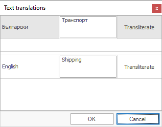

# Multilanguage fields 

<b>Multilanguage fields</b> are text fields usually present in the nomenclatures (name, description). You can transliterate the values in these fields using the <b>Text translations</b> form. 
Open the form by clicking the  button or by selecting it in the dropdown menu:

 

<b>Example</b> :
- by opening a ‘Product group’ form
- by opening a ‘Product group’ field
- by selecting the function from the dropdown menu or
- by clicking the   button

The <b>Text translations</b> form opens

 
Click on <b>Transliterate</b> and a list with the available languages will appear on the side.

The name of the product group displays in the first field (reserved for the main language).

To set transliteration in some of the listed languages, click on the <b>Transliterate</b> button, then choose ‘From Bulgarian’ (which will show the system's main language).
  
To set transliteration for all of the available languages, click on <b>Transliterate Current to Others</b> located on the bottom of the list.

<b>Note</b>:
- The <b>Transliterate</b> button is set to only work from English to Bulgarian and vice versa.
- Unless the <b>Transliterate</b> button is clicked upon, the multilanguage field will be written out using Latin (English) symbols when the system is switched from English to Bulgarian language.
- The <b>Transliterate</b> button allows for writing out initial text that can be edited afterwards.
