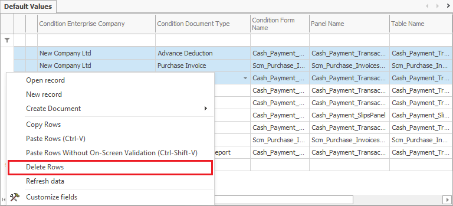

# Setting/Deleting Default Values

The <b>Set as default value</b> function is used to avoid repeated entering of the data for objects alike.

To pick a Default Value, go to the field of choice, right button-click and select function <b> Default Value→ Set as default value</b>  from the context menu.

Note: the <b>Default Value</b> function requires to be enabled </b>Customize current view</b> function 

 

  <b>Set default value</b> form opens. It displays a set of options and sub-options to choose from. 

  

Press the ‘OK’ button to save the options selected. 

<b>Example</b> :

The customer wants to set a ‘Bank Transfer’ payment option as default in a ‘Sales order’ document. Select the following options: ’For the current user’ and’ for the current document type’. Any time a new ‘Sales Order’ document is opened, the ‘Bank Transfer’ value will automatically appear in the <b>Payment Type</b> field. 
The <b>Clear default value</b> function clears the data that has been set as default.
Go to the field of choice. Right button-click and select the <b>Clear default value</b> function from the menu.

 

The <b>Field Default Values</b> navigator opens up. Another way to open it is: <b>Main menu→Setup→Tools→Field Default Values</b>

Mark the row in the panel with a left button-mouse click. Right button-click to select the <b>Delete rows</b> function.

<b>Example</b> :

The default value set – ‘Bank Transfer’ in the ‘Payment Type’ field of the ‘Sales Order’ document is to be cleared. When the default value set is cleared as shown, the ‘Payment Type’ field will appear empty the next time a ‘Sales Order’ document is opened.

