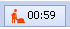
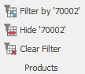

# User system setting 

In the **Settings** the user can select a previously set range of functions or customize the system on their own. 

## Optimize the user interface to be used

The *@@name* system is supported on any device, such as a personal computer operating with a mouse and a keyboard, devices having a touch-screen (smartphones and tablets) or in a  mixed- working mode
- *with mouse and keyboard* - the interface elements are more compact so that as many elements could fit on the working plot.
- *with mouse, keyboard and occasional touch on screen* - some of the elements are enlarged so it would be handier when working with the touch-screen, while others are in a form suitable for operating with a mouse and a keyboard.
- *on tablet with touch only* - buttons, tabs and any other elements activated by touch are  enlarged. The working plot fits much less of them, but they come handier. The elements designed for a mouse and keyboard operation remain hidden.

## User interface complexity

This term signifies the complexity of the interface according to the rights given to the user in this system. This option has the following hierarchy:
- Basic user – No Navigator or Edit menu in the command ribbon.  There are some restrictions in the visualisation of the ‘View’ or ‘Data’ tabs. The ‘    ‘menu is  visible, yet the user can’t refresh or edit. The ‘ Functions’ tab is visible as well, still having some restrictions. 
- Advanced user -  The user has access to the Navigation menu in the command ribbon. They can copy, paste, cut, group and sum. In the ‘  ‘ menu they can edit and refresh. 
- Super user – All of the menus and functions the Advanced user has the access to are available for the super user. They can also view canceled and transit documents, change default values for given fields  and work with expression fields and distribution of the additional sums. 
- Administrator – has full access rights for the system and  all the settings. 

Touch- screen interface and Complexity of the interface can be opened from the **Help** button  as well. 

## Visual settings
The first section of settings is related to the possibility for fitting the interface to the working  of the user.

- **Use Start Screen** 
- **Show form descriptions** - If the option is marked with a tick the system description will appear

- **Show form status bar** -if the field is ticked, the status bar will appear at the bottom of the document forms. It gives information about the current form. The statuses can be changed with the status bar. 

- **Show the elapsed working time of the current task** – a clock, tracking the working time for the task will show up in the button of the fast task list 

- **Show navigation buttons row** – having this field marked with a tick, will get additional buttons such as *Open record*, *New record*, *Print* etc. to show up in the bar in the Navigators under the record table. Thus, the Navigator will get the appearance of the one in system version 2 or older .

- **Use simple layout for filter panels** – when marked with a tick, the names of the fields in the 
Filtering panel will appear gray until the insertion of a value. When we do so, the names will disappear while the values remain visible. This optimizes the size of the panel in width. 

Detailed look in the Filtering panel will let both the values and the names of the filtering fields be visible.

- **Open definition forms in ‘Edit mode’** - the definition and navigator forms will appear locked when Edit mode is not active by default. Data cannot be edited as a prevention from faulty changes. The user can make corrections only  in *Edit mode*. When marking the *Open forms in Edit mode* option with a tick, the definition forms will automatically open with an activated *Edit mode*. This will make the work of the user frequently applying changes in the definitions in the system easier. 

- **Show filtering buttons** - if the field is ticked, filtering by a *certain cell value* will be available for each Navigator. 

- **Query Save on close** - Having this option ticked would mean that a confirmation panel will show up when closing a document tab, asking whether or not the user would like to save the changes they have made in the document.

- **Use default Windows mail client**  
- **Enable debug log** 

## System settings 
- **Refresh cache** – when working with the system, a fraction of the data is saved on the PC and is later extracted from it. This will accelerate the workflow, although some data might not have been updated to the most recent version.When Refreshing cache, data is extracted from the server thus providing the latest information.
- **Memory Usage** - a new window ‘Memory optimization’ will appear when clicking on the button. The selection should be based on the parameters of the computer the user is working on or whether the device is slower with a faster network, vice versa or they are nearly equal. 
- **Change Enterprise company and location** - this function allows switching the Company  company** or the branch they are working with. The function can be enabled through the **command ribbon** as well. 
- **Change  password** -  here, the user can change their login password for the system. This function can be also opened through the *Settings* menu. 
- **Show remoting log** 
- **Exec stats** - used for analysing the work in the system. The journal gives information about the program functions called in and their execution time. Read more about **how to work** with Execution statistics
- **Network Test**  

## Notifications settings
**@@name** is a system created with the purpose of securing and making business management easier. Live Notifications system aids the work of the user with its functions - creating reminders or receiving notifications in real time. Thus the user would not bother constantly thinking about when and what  needs to be done.  Entering the task in the system would be enough. The user can turn off some of the notifications, which will accelerate the work of the system. 
- **Enable real-time notifications** -  if the option is marked, the notification system will be **enabled** showing real time notifications, such as reminders, emails or system notifications etc. Enabling the option would influence the whole system and all kinds of notifications. 
- **Notify for reminders** - by marking the option, showing reminders is allowed. Turning the reminder option on or off does not influence the email notifications.
- **Notify for new mail** - marking the option with a tick enables email notifications. Turning it on or on does not influence Reminders
- **Performance benchmarking mode** 
