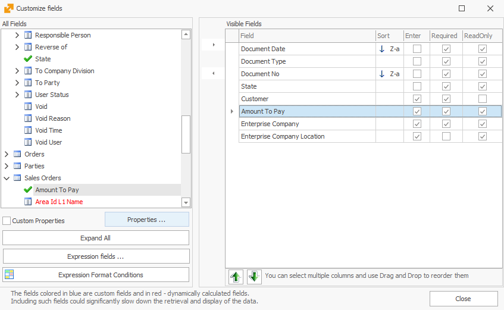
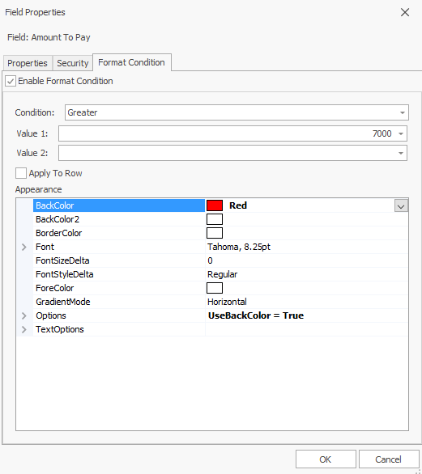
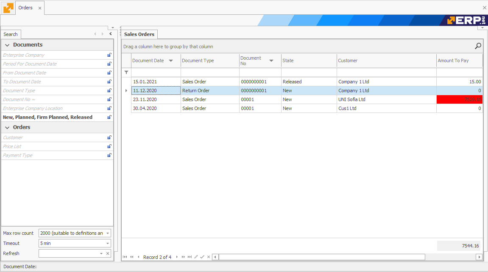

# Coloring by cell

This procedure will show you how to color individual cells (fields) in a navigator.

As an example, we will set all sales orders with an amount to pay greater than 7000 BGN to color in red, in the Sales Orders navigator. For this purpose you can go to:

<b> Main Menu -> Sales -> Orders Navigator </b>

The <b> Sales Orders </b> navigator shows the sales orders issued to our clients.

1.	Click on <b>Show Data</b> and then right-click on the rows of the navigator. From the displayed menu select <b>Customize fields</b>; 
2.	Select a given field. In this case, click **Amount To Pay** and then **Properties…**:

3.	<b>Field Properties</b> window will open. From here, go to the <b>Format Condition</b> tab and check the <b>Enable Format Condition</b> box. As a condition, select <b>Greater</b> and set **Value 1** to be 7 000. After this, you can choose the color - let's choose the red color:

The check box <b>Apply To Row</b> gives you the opportunity to only color the selected cell (when it is unchecked) or to color the entire row when the field conditions are met.   

4.	Click “OK” and close the Fields Properties window. Now every cell with an amount to pay over 7 000 BGN is colored in red:
 

