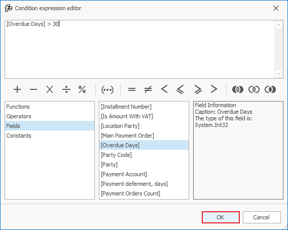
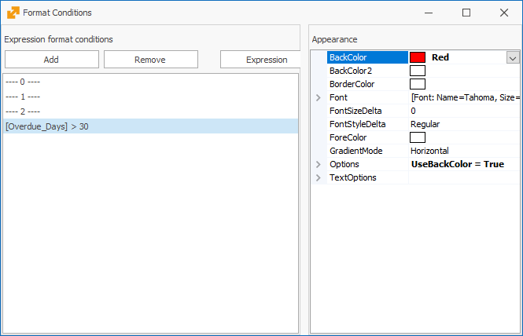

# Conditional coloring by row

This procedure will show you how to view the rows of overdue payments in color (for any navigator). 

As an example, we will set all payments, overdue with more than 30 days, to show up in red. For that purpose, you can first open the respective menu: 

<b>Home Menu -> Finance -> Payments -> Payments status </b>

The <b>Payments status</b> navigator shows the payments due to/from your company for different contractors – customers, suppliers.

1.	Click on <b>Show data</b> and then right-click on the rows of the Navigator. From the displayed menu select **Customize fields**; 
2.	The <b> Customize fields</b> window will open, then you need to click on the <b>Expression format conditions </b> button: 

 
A window will open for you to enter the desired conditions:

3.	Click on <b>Add</b> to open a new window. Here, select the Fields option. In the small, middle section you will see all fields that you can use to set conditional coloring for:

 
As an example, we will set all payments, overdue with over 30 days, to light up in red. For that purpose, double click on the option <b> “Overdue Days” </b> (it will get added to the expression at the top of the window). Then manually type in “> 30” (the greater-than sign and the number 30, without the quotes) after [Overdue Days].

Click on the <b>“OK”</b> button

4.	After you set the condition, you need to choose a color:

5.	With that, the program will color all payments overdue with more than 30 days in red.
