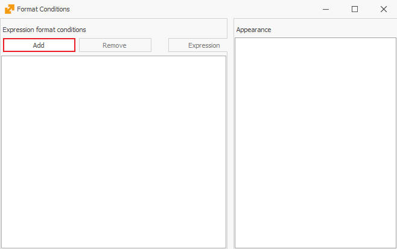

# Conditional formatting

The procedure will show you how to format the size, thickness, style, and font color of the text as well as the color of the field frame in a given navigator.  
	For example, we will format the thickness and font color of the text of sales orders rows in the <b>Sales Orders navigator</b>. For this purpose you can go to:    
	<b> Main Menu -> Sales -> Orders navigator </b>

1.	Click on <b>Show Data</b> and then right-click on the rows of the navigator. From the displayed menu select <b>Customize fields</b>;
2.	The <b>Customize fields</b> window will open. Click on the <b>Expression Format Conditions</b> button: 

A window will open for you to enter the desired conditions:

 
3.	Click on **Add** to start making a new condition. Here select the **Fields** option on the left. In the small middle section you will see all fields that you can use to set conditional coloring for:

 
In this case, we will set all new sales orders to show in bold. For that purpose, double click on the <b>State</b> field (it will show up at the top of the window). Then manually type in there <b> == ‘New’</b> (two times the equal-to sign and the word New in single quotes).

Click the '**OK**' button.

 
4.	After you set the condition, you can choose a color and set a bold font, as you see in the picture above.
5.	After you close the window, the program will display all new sales orders in bold:

