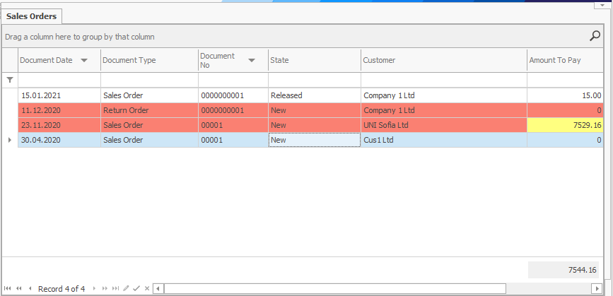
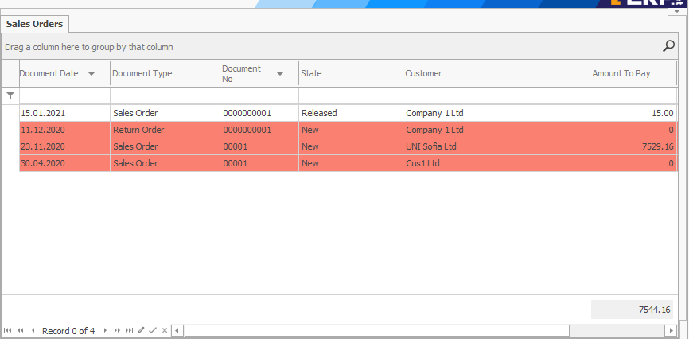
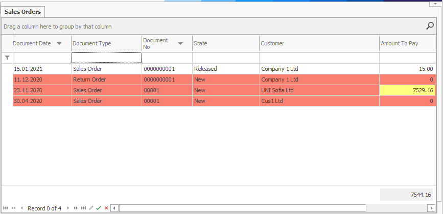

# Conditional coloring

<b>Conditional coloring</b> allows you to change the color and font in any field for the different reports, navigators, and document forms by a preset condition. It helps the visual comprehension of the information. You can set it for a single cell, the entire row, or a specific cell in an already colored row. 
 

This way, for a start, in the <b>Sales Orders navigator</b>, you can set the New sales orders to get colored:
 

You can further color the fields, not entire rows, with an amount to pay greater than 7000:
 

The program prioritizes the color you set for a specific field over the color for the entire row, as shown on the picture above. Thanks to this, you can set reports colored by multiple criteria. 
You can also edit not only the color of the fields but also the size and font, the border color, etc. These additional settings are available in **Appearance** section of the **Format Condition tab** of *Field Properties*.
