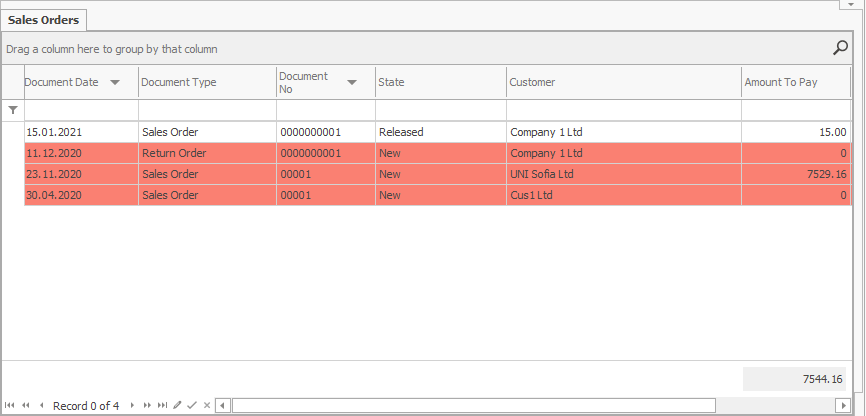

# Conditional coloring

<b>Conditional coloring</b> allows you to change the color and font in any cell or row in the different reports, navigators, and document forms by preset conditions. It helps the visual comprehension of the information. You can set it for a single cell, the entire row, or a specific cell in an already colored row. 
 

This way, for example, you can set up all New sales orders in the <b>Sales Orders navigator</b> to be colored in red:
 

You can further color in yellow some of fields, not entire rows e.g. with an amount to pay greater than 7000:
 

The program prioritizes the color you set for a specific field over the color for the entire row, as shown on the picture above. Thanks to this, you can set the reports to be colored by multiple criteria. 

You can also edit not only the color but also the size and font, the border color, etc. These additional settings are available in **Appearance** section of the **Format Condition** tab of *Field Properties*.

For more information how to set up the coloring, see:
[!list folder="." depth=0 style="bullet" limit=100]
