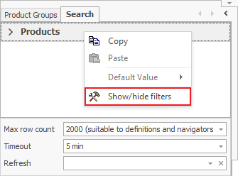
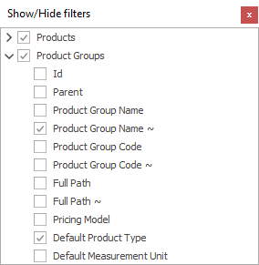

# Customizing filters

By <b>customizing filters</b>, you can set what filtering criteria will display in the *Search* panel. To access that setting, right-click on the *Search* panel and select *Show/hide filters*. 

Here you can set which filters you need to be visible. Visible fields will have a checkmark next to their name:
 

The Filters with sub-filters in them will display with this arrow when hidden:  and it will change when you expand them: .
If one of the main filters isn’t visible, its sub-filters won’t be visible as well, no matter if you checked them or not.

You can also customize your filters by locking in a certain value in them.
