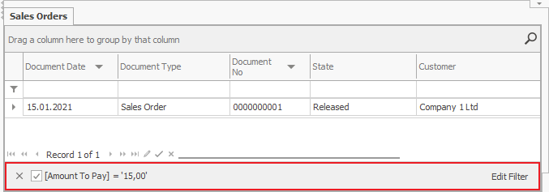
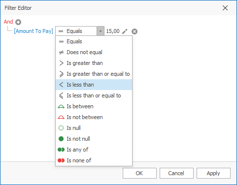
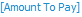

# Filter editor

You can use the <b>filter editor</b> in the navigators of @@winclientfull to narrow down the filter that you are using for limiting the number of shown records. In order to use it, you must apply a filter for the data. To bring up the filter editor, click on the row with the filter description and then Edit Filter.

Give the filter editor conditions, which has to be true for the resulting records that will show. Conditions will be possible for every field.

Every condition contains a field name and a value or a field for comparison.  
Edit the filters by using the following buttons:
-	  - add a condition; 
-	 - edit the comparison field or add a value;   
-	 - remove the filter; 
-	 - change the field;
-	  - change the condition.

***For example:***  
You can match conditions with the keywords AND & OR. If you want the result to answer both conditions <b>simultaneously</b> (read it with the connective word “<b>and</b>”), use <b>AND</b>. If you want to see results, which answer <b>one of the two conditions</b> (read it with the connective word “<b>or</b>”), use <b>OR</b>.
