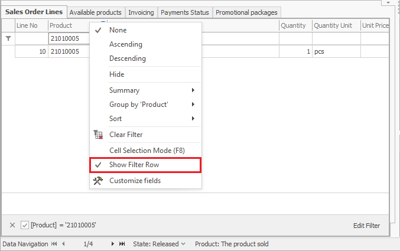
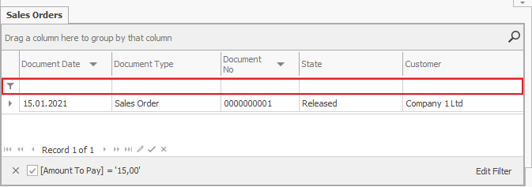

# Filtering by row 

The <b>filtering by row</b> is another option for limiting the number of shown records when searching for specific information. It can be accessed by right-clicking on the headline of the chart. In order to save the filter for future use, you can activate the *Customize Current View* mode.

Above the Navigator, under the headline of the chart, a new row opens:

 
Use the filter row by <b>entering a part of the searched text</b> in a chosen cell. If you use an interval before the searched text, the filter row will search not only at the beginning of the text in the field, but also at the end of it. You can search in one or more cells simultaneously (every following search will narrow down the result). Press the **Enter**key when you are ready with your selections.
