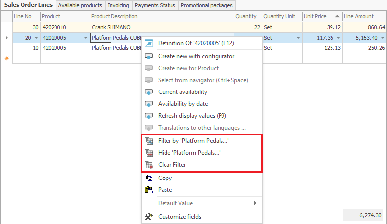

# Filtering by values

You can <b>filter by values</b> when you have set a criteria in the Search panel. This can help you search for single or multiple records among the loaded data in the Navigator. There are two variations of this method – Filtering by column values or Filtering by cell values. 

## Filtering by column values
In order to filter by one or two values from a single column, click the button at the upper right corner of the column's header:  
  
In the drop down menu, you can select the values to filter by. Choose the ones you want to appear by putting a check mark in front of them:

  

After applying the filter, you will only see the rows where the selected fields have the chosen value. 

> <b>Note:</b>
> You can filter by more than one column. Nested filters will use the current filter as a base for each additional one, and this way the amount of returned data will be even smaller. To make it clearer, read the nested filters with the connective "and". For example: "All the sales that are clients of SMAC Ltd and are from the date 12.02.2012." 

## Filtering by cell values
In order to filter data by a specific cell value in the Navigator, you can mark the cell with the wanted value and press the according filtering button from the Command Ribbon: 

 
-	<b>Filter by</b> – after selecting this button, only the rows containing the selected cell value will show; 
-	<b>Hide</b> – after selecting this button, the program will hide all the rows containing the selected cell value. Only the rows that DO NOT contain the selected cell value will show;
-	<b>Clear Filter</b> – by selecting this button you will clear the selected filter and you will see the data in the Navigator in its initial form. 
You can bring up the same functions by right clicking on a specific cell in the Navigator:

