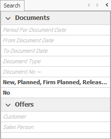
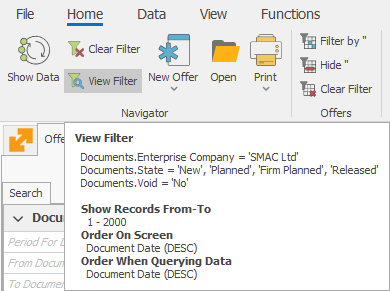
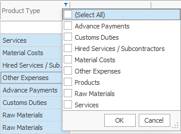
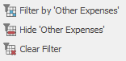
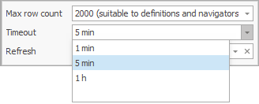
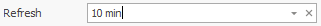

# Filtering

The <b>Filtering</b> is a method for organizing the results of your searches in the system. You can set your search criteria and we will show you only the matching results. 
The main benefits from filtering are:
-	<b>Reducing</b> the <b>time</b> to find what you need, as you are searching through less information;
-	<b>Reducing</b> the <b>load</b> on the servers, networks, and on the client computers.
You can Filter in two ways – on the <b>server</b> or on the <b>client compiter</b> (the user’s PC).

## Filtering on the server
When you Filter the server, you will receive back less information. This means spending less time visualizing the data (especially for large amounts of data, when it can take up significantly more time) and it will reduce the load from the client computer and the network. To Filter on the server, set your criteria in the Search panel. You will find this method useful when searching for specific information in your daily work.
  

If you need to review the criteria for the Filter, click on the *View filter* button.  
An information box will appear under the command ribbon:
 

You can set back a Filter to its default (program) settings by clicking on the *Clear filter* button .
This won’t delete the Filter completely, but rather reset it to its initial settings. 

## Filtering on client’s computer
When you filter on a client computer, all the information is already downloaded from the server. And the client computer is doing all the calculations (applying the criteria). You will find it useful for working with large amounts of various information (like for managerial analyses). This method allows you to Filter in two ways:
-	Column
 

-	Field value
 

The two methods for filtering can also be combined by first applying Filters when loading data from the server and then using the client computer to find specific results.  

## Row count
You can also narrow down the received results by <b>limiting the max row count</b>. You can set this value by clicking on the *Max Row Count* field at the bottom left corner:
 

To avoid overloading the server and networks, we advise you to go for the lowest row count possible, that will be enough to show the appropriate Reference. By default, the program’s Max row count is 2000. If the Reference contains over 2000 rows, the numbers in the report won’t be accurate.

## Timeout
The <b>Timeout</b> option in the bottom left corner is another way of limiting the amount of data. It sets a time limit for the filtering to complete. If the time runs out before the end of the process, the application stops with no results. By default, the Timeout is 5 minutes. But loading an extensive Report can take up <b>a lot of time</b>. That’s when you can find it appropriate to extend the time limit. You can set this value by clicking on the *Timeout* field:
 

When you set your criteria, you can start the search from the 
<b>Command ribbon >> Show data</b>  .

## Refresh
You use the Navigators to display data. In many cases, the output data isn’t created by the people responsible for it. This happens with auto-generated dcuments, based on document flows. This way, people responsible for the payments do not take care of documents creation. The sales and invoices in the system create them automatically instead. Another example could be the warehouse orders. Sales generate them, not the person responsible for the warehouse.
In this and plenty of other cases, the users need to see the latest data. You can ensure this by setting the Navigator to refresh automatically after a given time. For that purpose, from the *Search* panel, set the refresh interval for the Navigator (the number of seconds after loading the data, after which another data download starts). After you’ve downloaded the data, it will remain in focus at the top of the Navigator. 
 

The Navigator won’t refresh if you set the value to 0. You need to set <b>individual timers</b> for refreshing each Navigator. You can also set different timers when it’s needed. The *Change Current View* mode must be active to make those changes.       
The system offers the ability to save different views with default filters when filtering the server. Filters automatically load in such views. You can save filters only in named Views.

 
