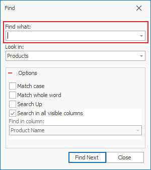
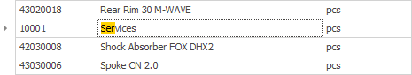

# Finding 

The Find tool can easily go through large amounts of data for you. You can search in various ways: 
through the Filtering Row, the Search Navigation button, or with Quick Search. 

## Find Form

You can use the Find Form to quickly seach by a word, fraction of a word, number, or other elements from the page you are looking for. 
You will find it in the <b>Command Ribbon >> Data >> Find </b> (or with Ctrl + F):

 

You need to fill out:
- Find what – the word or number that you are looking for;
- Look in – this field is auto-filled with the name of the panel it's been opened in. But you can still choose another panel from the drop menu;
- Options – choose the function that would make your search easier; 
- Find in column – in the drop menu, you can choose a field from the currently selected panel and look for a word or number in it.

After you've selected the fields you need, press the <b>Find Next</b> button. If there are any found results, the program will colorize their fields.

## Quick Search  

The <b>Quick Search</b> is a quick way to access a record from a column by entering the beginning of the text you are searching for. Besides columns, you can use this search method in the <b>Visible Fields</b> Form in the Field Tree for easier field detection. 

To use this method, hover over a column (or a field in the <b>Field Tree</b>). Then directly type in the text that you are looking for. The system will find and mark the first matching result. You can narrow down the search with every following symbol. The program will search and mark the results matching the entire text you enter.

You can go through all the records, starting with a specific letter that are in a given, by pressing the letter couple of times (useful method for finding a field in the  <b>Visible Fields</b> Form).

