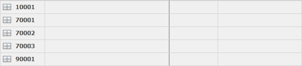

# Grouping

You can use <b>grouping</b> when you need to summarize the available data by a specific criteria. 
Grouping is one of the Navigator tools for analysis. It benefits any managing activity in your company. 

You need to activate the *Customize Current View* mode to group data. Click on the name of a column and drag it to the top. 

 

As a result, the data will be grouped by the dragged column:

 

The grouped data can be in <b>open groups</b>, with all the rows visible:

 

Or they can be in <b>closed groups</b>, with only their head rows and summarized information visible:

 

To open or close a group, click on the symbol next to it (plus or minus). If you need to open or close all groups, click on the symbol next to the name of the grouping column (factor) in the header row.

 

You can also group on <b>multiple levels</b>. In this case, every following factor creates a subgroup to the previous one.

 
