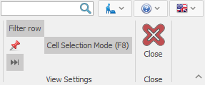

# Navigators

The <b>Navigators</b> are system forms that show a lot of information in a summarized way. You can find them useful for visualization, managing, and editing data.

 Their <b>main functions</b> are:

- Better <b>orientation</b> in large amounts of data;
- Allowing <b>searching</b> and <b>opening</b> Documents or Definitions;
- Filtering data by your criteria to <b>narrow down</b> the visible Records; 
- Grouping and Summing data to extract <b>total values</b>;
- Sorting – setting an <b>order</b> for better organization;
- <b>Searching</b> in the data;
- <b>Editing</b> (adding, modifying, and removing) data;
- Mass data <b>import</b> – importing large amounts of data, from an outside source;
- An option for <b>exporting</b> data to Excel;
- An option for visualizing data in a <b>graphic</b> format;
- An option for <b>defining reports</b>;

You can use a Navigator to find answers to various questions. For example, “Which product has the most sales?”, “Which customer provides the most income?”, “What are the financial results for the period?” and so on. They provide you with a quick access to your data in the most practical order (filtered, grouped, or sorted) so that you can work only with the needed information. 

On the bottom left corner of the data panel, you will find buttons for navigating the Records. You can move between consecutive Records from the results, from page to page, or jump directly to the first or last record.

| Button | Meaning | Button | Meaning
| ---- | ----- | ---- | ----- | 
|  | First Record |  | Last Record |
|  | Previous Page |  | Next Page |
|  | Previous Record |  | Next Record |

You can show or hide the record navigation from the <b>Command Ribbon >> View >> Record navigation</b>:

