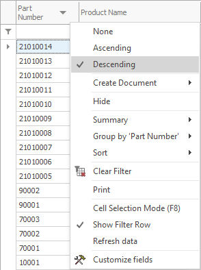
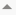
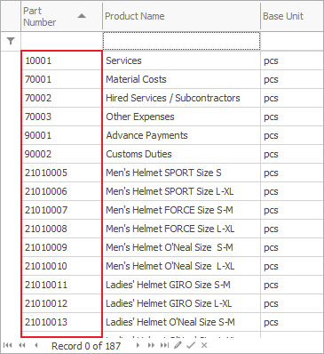
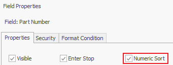
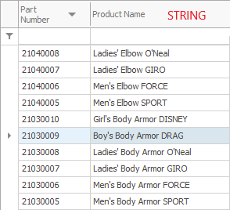

# Sorting

You can use sorting to organize data by a certain criterion (alphabetic order, data, number…). If you prefer to <b>keep</b> the changes after you close the program, you need to be in <b>active</b> Change Current View mode. Otherwise, the changes will <b>disappear</b> after you close the Form.  
To see this option, right-click on the name of the column, you need to sort: 

From the context menu, you can select one of three options:

- None – the data doesn’t follow any particular order;
- Ascending – when you choose this option, the system will automatically sort the data in ascending order ;
- Descending – sorts the data in Descendent order .

When you sort the information in a column, you will see an arrow showing the applied direction.  
Another way of Sorting is by clicking in the column’s name (every following click will switch between the directions).  
You can also sort by <b>multiple columns</b>. 

The main sorting is the first one, while every following one depends on the main one. After you apply the sorting on the first column, the program will use the following columns to organize repeating values. 

If you need to sort by multiple columns, hold the Shift key on your keyboard and click on the desired column. Or you can sort by multiple columns by going through the settings in the context menu (as described above) for each individual column.

## Sorting Methods

When a field contains numbers, the program can treat them either as numbers or as text. Depending on how the program treats your data, you may receive different results. Sorting is one of those cases. Numeric Sort allows you to sort the values in a rising or decreasing order. String Sorting allows you to compare values as words – in alphabetic order. To set the sorting method, go to <b>Customize Fields >> Properties</b>.

The difference between the two methods is most visible in the accounting Forms:

 
