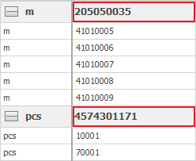

# Summing

You will find <b>summing</b> useful for collecting total values for your data. Summing is one of the Navigator tools for analysis. It can benefits any managing activity in your company. 

You can sum, based on the shown data in the navigator. It doesn’t matter if the data is in a group or not. To add a <b>total value</b>, right-click on a title row in the chart. Select the <b>Summary</b> menu and choose what result you need:

 

After you choose the Sum option, the total Sum will appear under the respective column. 

  

If there is an active Grouping, the total Sum will appear next to the name of that group.

  

You can Sum only one time while the form is open, or save the Sum in the View (and autoload the Sum value every time you open the Form). If you don’t have the *Change Current View* mode active, all the sums you make will disappear after you close the program. To save the sums in the View, you need to be in *Change current view* mode and click on <b>Save layout changes</b>. 
