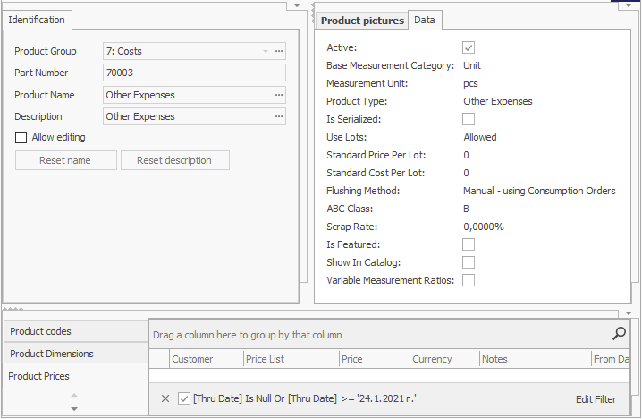
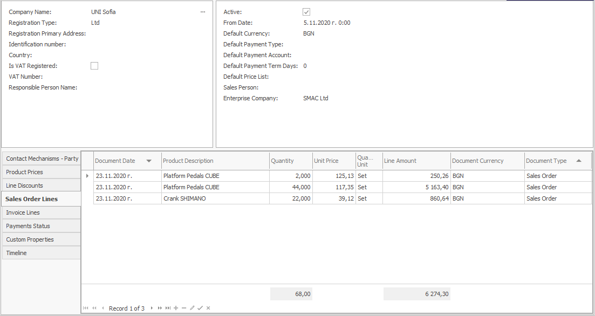

# Definition System Form

With the <b>Definition System Form</b>, you can edit the characteristics of a Definition - product, client, storage, document types, etc. Depending on the Definition, the form contains different panels with specific characteristics.  
For example, if you are creating a new product, you will get a panel describing that product, one for choosing the technology for its manufacturing, etc.

 

When you are filling out a Definition form for a customer, you will see panels for entering contact information, props, panels, containing your entire history with that customer, and more.

 
