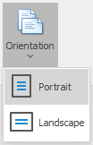
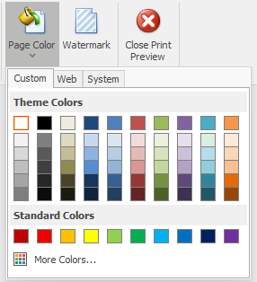

# Print preview

The <b>Print preview</b> allows you to review the Form before you print it and adjust its properties if needed.

You will find it in the Command Ribbon >> Home >> Print >> Print preview.

 

The Form will open in a separate window which looks like this:	

 

The optional settings are:

- <b>Export to</b> - save the printout in the most used text (.pdf, .doc, .txt), graphic (.gif, jpeg, .png) and tablet (.xls) formats.  
This way you have the exceptional freedom to edit or protect the data according to your needs.  
To save the printout as a file, click on the desired format button:

- <b>Send via e-mail</b> - choose the desired format, and it's automatically attached to a new letter. 

- <b>Scale</b> – scale by the percentage of the original size or fitting on a page:

- <b>Orientation</b> – change the page orientation to Portrait or Landscape:

- <b>Page Size</b>:

- <b>Page Color</b>:

