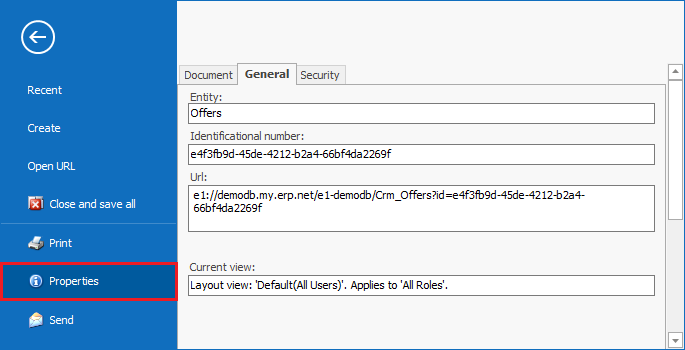
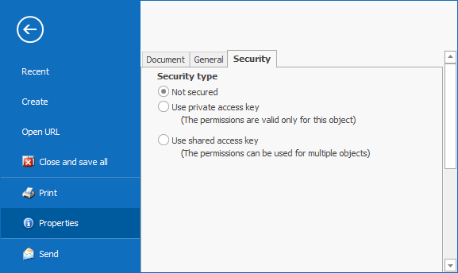
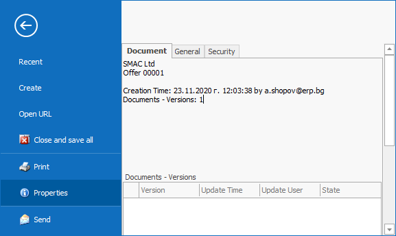

# Properties form

In the <b>Properties form</b>, we systemize the information about documents and definitions.  
Open it in the File Menu >> Properties.

 

You can find the following within the Properties Form:

1. <b>General</b> tab (for documents and definitions):

- Entity – shows the name of the respective form
- Identificational number – shows a unique alphanumeric code. The program uses it for identifying the form.
- Url – shows the web address of the Form. It is a system name the program uses to address these types of forms.  

Combining the Url and the Identificational number fields gives you the connection to this specific Form. You can send it via e-mail. 

2. <b>Security</b> tab (for definitions and saved documents) – allows you to review and change the access rights to thе Form:

3. <b>Document</b> tab (only for documents) – provides information as to who, when, and for what company created the document, along with the amount of changes it's been through. At the bottom of the page you will find a list with all the versions of the document.

