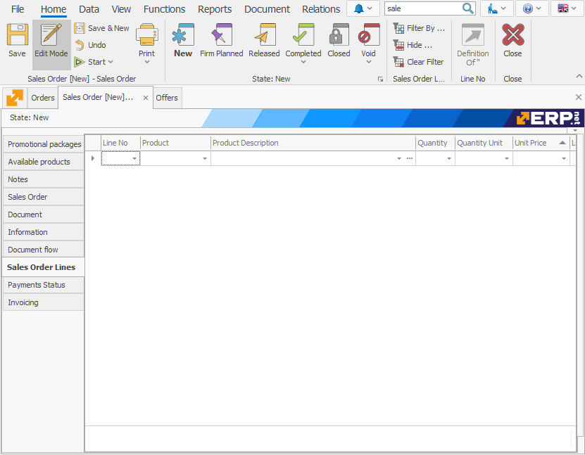
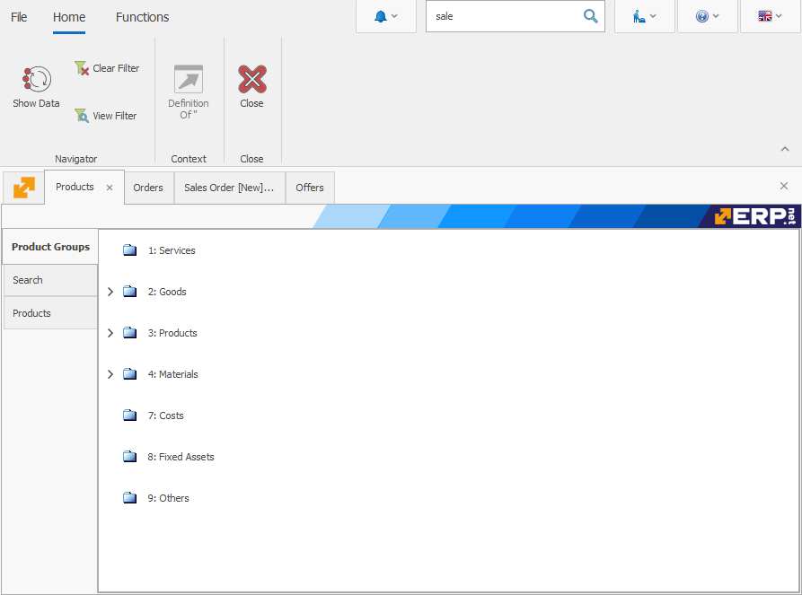

# Tablet view settings

A key differentiator of @@winclientfull is the opportunity to use an operating mode, suitable for <b>touch devices</b>. The system offers a three-stage 'touch' optimization, which turns your tablet from a device for content consumption into a device that can be used for creating diverse cooperation information. This allows for the device to update, receive and report completion of tasks. You will be able to: track the entire required information for a project or the entire production chain; track specific tasks; check and supervise different processes’ completion state; as well as the condition of the machines, work force, production parts usage for a period of time; or get statistical analysis of the process management in real time.

Working with a tablet has several settings and we recommend that you configure ahead of time. The forms which you will use have to be arranged in special views, suitable for touch devices.    

Here are the steps you have to take to create the according views:

1.	Create a new portrait view named 'Tablet'.
2.	Arrange the panels in one region.
3.	The buttons for switching between the panels should be on the left.
4.	We recommend that you remove or move to the right the wide columns like names of products, warehouses, etc. if you are dealing with a panel with multiple rows
5.	In order to avoid having too many fields, you have to leave only the key ones or the ones you use the most. It’s best for the fields that you want to edit to be on the left, despite having the option to scroll down. You need to do this in order to avoid missing writing information in a field.
6.	We also recommend that you remove the buttons **Navigation, Filter** and **Copy/Cut** and **Paste** from <b>File >> Settings</b>. This way you will have a simpler view on the tablet. The idea is for the tablet view to be as clean as possible.    

It will look like this:

 
7.	We recommend that you select *Basic user* from the *Optimization menu*. This way you can simplify the system for a more accessible outlook.
8.	We also recommend that you select the *Touch only* mode in the same menu.

 
The Windows keyboard must always show at the bottom of the screen as it is one of the most important requirements for using @@winclientfull on mobile devices.

After all of these settings are applied, here is how the tablet view will look like:

 
The view of the product navigator will also change, but it will still be well suited for the *Touch only* mode. 

