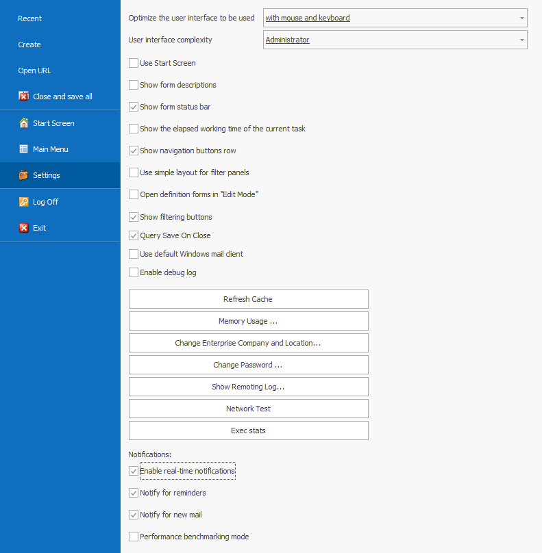
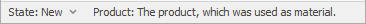
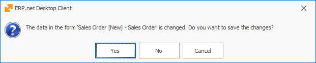

# User system settings

In **Settings**, users can select a previously set range of functions or customize the system on their own. 

## Optimize the user interface 

The *@@name* system is supported by every device, including personal computers operating with a mouse and a keyboard, touch-screen devices (smartphones and tablets) and mixed devices.
- **with mouse and keyboard** - interface elements are more compact so that as many could fit into the working plot as possible.
- **with mouse, keyboard and occasional touch screen** - some of the elements are enlarged so it would be handy when using touch-screen, while others are in a form suitable for operating with a mouse and a keyboard.
- **on tablet with touch only** - buttons, tabs and other elements activated by touch are enlarged. The working plot fits fewer of them, but they're easy to reach. The elements designed for a mouse and keyboard operation are hidden.

## User interface complexity

This term represents the Complexity of the interface according to the rights of the user in thе system.

This option has the following hierarchy:
- **Basic user** – no access to the Navigator or Edit menu in the command ribbon. There are restrictions in the visualisation of the *View* or *Data* tabs. The ‘  ‘ menu is visible, but the user can’t refresh or edit. The *Functions* tab is visible as well, with some limitations in place. 
- **Advanced user** - has access to the Navigator in the command ribbon. Can copy, paste, cut, group and sum. In the ‘  ‘ menu, the user can also edit and refresh. 
- **Super user** – аll menus and functions the Advanced user has access to are available. This user can also view cancelled and transit documents, change default values for given fields and work with expression fields and distribution of additional sums. 
- **Administrator** – has full access to the system and its settings. 

The touch-screen interface and Complexity of the interface can be opened from the **Help** button as well. 

## Visual settings
The first section of settings is related to the possibility of fitting the interface into the working of the user.

- **Use Start Screen** 
- **Show form descriptions** - If the option is ticked, the system description will appear.

- **Show form status bar** - if the field is ticked, the status bar will appear at the bottom of the document forms. It gives information about the current form. Statuses can be changed from the status bar. 

- **Show the elapsed working time of the current task** – a clock which tracks the working time of the task will show up inside the button of the Fast task list. 

- **Show navigation buttons row** – if the field is ticked, it will expand additional buttons, such as *Open record*, *New record*, and *Print*, inside the Navigator bar, under the Record table. Thus, the Navigator will look like the one in system version 2 or older.

- **Use simple layout for filter panels** – if ticked, the names of the fields in the *Filtering* panel will appear grey until a value is inserted. When that's done, the names disappear, but the values remain in place. This optimizes the size of the panel in width. 

A detailed look into the *Filtering* panel will reveal the values and names of the filtering fields.

- **Open definition forms in ‘Edit mode’** - the definition and navigator forms will be locked if Edit mode is not active by default. Data cannot be edited so that potential faulty changes are prevented. Users can make corrections only in *Edit mode*. When ticking the *Open forms in Edit mode* option, the definition forms will automatically open with an activated *Edit mode*. This will ease the work of users who frequently apply changes to the definitions.

- **Show filtering buttons** - if the field is ticked, filtering by a certain *cell value* will be available for each Navigator. 

- **Query Save on close** - Having this option ticked means that a confirmation panel will show up whenever a document tab is closed. It would ask whether or not the user would like to save the changes they have made in the document.

- **Use default Windows mail client**  
- **Enable debug log** 

## System settings 
- **Refresh cache** – when working with the system, a fraction of the data is saved on the PC and later extracted from it. This accelerates the workflow, but some data might not be updated to the most recent version. When Refreshing cache, data is extracted from the server, thus providing the latest information.
- **Memory Usage** - if the button is clicked, a new ‘Memory optimization’ window will appear. Selection should be based on the parameters of the computer the user is working on, whether the device is slower on a faster network, vice versa, or nearly equal. 
- **Change Enterprise company and location** - this function allows switching the Company to the branch users are working with. The function can be enabled from the **command ribbon** as well. 
- **Change password** - here, users can change their login passwords. This function can also be opened from the *Settings* menu. 
- **Show remoting log** 
- **Exec stats** - used for analysing the work in the system. The journal gives information about called-in program functions and their execution time. Read more about **how to work** with Execution statistics.
- **Network Test**  

## Notifications settings
**@@name** is a system created with the purpose of securing and making business management easier. Live Notifications aid the work of the user. The system creates reminders or receiving notifications in real-time. The user does not think about when and what needs to be done. Entering a task in the system would be enough. Some of the notifications can be turned off, which will accelerate the work of the system. 
- **Enable real-time notifications** -  if this option is checked, the Notification system will be **enabled**, showing real time notifications, such as reminders, emails or system notifications. 
- **Notify for reminders** - if checked, it allows reminders to be shown. Turning it on or off does not affect the email notifications.
- **Notify for new mail** - ticking the option enables email notifications. Turning it on or off does not affect reminders.
- **Performance benchmarking mode** 
