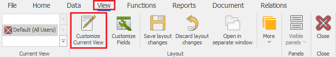

# Customize current view

The *Customize current view* mode is used to edit the way System forms look. You will find that mode deactivated by default when opening a form. This way you can't move fixed tabs. The *Customize current view* mode unlocks the following functions:

- Working with *Views*;
- Adding, removing, and resizing *Regions*;
- Adding, removing, and repositioning *Panels*;
- Adding, removing, repositioning, adjusting the Form and the color of the tabs;
- Adding or removing the short keys;
- Grouping and sorting;
- Setting default values;

Activate *Customize current view* mode through <b>Command ribbon >> View >> Customize current view</b> (or with the short key <b>Ctr+L</b>) or automatically by choosing the <b>Customize fields</b> option:

 

Before you exit the form, you should save the *View* if you need to save the changes.
