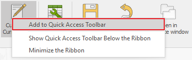
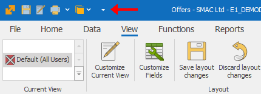
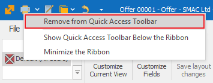
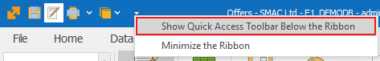
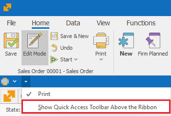

# Customize quick access

The command ribbon in @@winclientfull is designed in such a way so that the most used commands are the easiest to access. However, depending on your business, you will find different functions most useful. That’s why you can set quick access buttons, that will stay attached to the *quick access* toolbar of the program, regardless of what section you are currently in (and it remains persistent for that form and user). 

## Add to quick access toolbar

1. Enter the *Customize Current View* mode; 
2. Right click on the desired button in the command ribbon;
3. From the drop menu choose **Add to quick access toolbar**:

 

4. This will add the command you choose to the quick access toolbar:

 

5. Save layout changes.

## Remove from quick access toolbar

1. Enter the *Customize Current View* mode;
2. Right click on the desired button in the quick access toolbar or the command ribbon;
3. From the drop menu choose **Remove from quick access toolbar**:

 

4. This will remove the chosen button from the quick access toolbar:

 

5. Save layout changes.

## Position the Quick access toolbar

Depending on your preferences, you can position the quick access toolbar above or below the command ribbon. To do that: 

1. Click the arrow on the right  or right click the toolbar;
2. Select **Show quick access toolbar below the ribbon**:

3. The *Quick Access Toolbar* gets positioned below the command ribbon for all forms:

You can show the quick access toolbar above the ribbon in a similar way.
