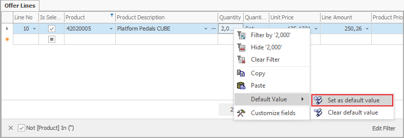
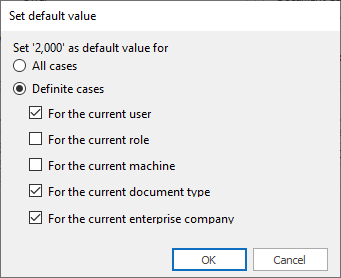

# Default values - set and delete

The <default values help you with data input. Once you set them, they will automatically load and you can change them later on if you need to. To set the default values, enable the *Customize current view* mode.

## Setting default values

1. Type in the value that you need as a default;  
2. Right-click on that Field and from the context menu choose the function <b>Default value >> Set as default value</b>:

 

3. The “Set default value” Form will open. Here you can choose for which cases to apply that value:

 

When you define multiple cases for a default value, they add up. Meaning that if you check “For the current user” and “For the current document type” the program will read it as “For the current user when working with the current document type” instead of “For the current user” or “For the current document type”.

## Clear default value 

This Function allows you to clear already set default values. When you clear the default value, the field will remain empty, unless you have another active default value.

1. Right-click on the field with a default value that you need to clear.  
From the context menu choose <b>Default Value >> Clear default value</b>:

 

A <b>Field Default Values</b> screen will open. You need to activate Customize Current View mode. 

2. Here you need to select the row containing the default form;
3. Right-click on it and from the context menu, choose Delete Rows.
