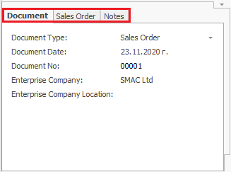

# Customize the workspace

The workspace, i.e. the way the forms in the @@winclientfull look like, can be customized in order to serve specific needs - of a particular business process, a particular role or just a preference of a user. 
Those customized forms can be saved in so-called *Views*, which can be easily selected and switched during the work with the programs.

System forms consist of *regions* and *panels*. 

The *regions* are separate parts of the work area that contain different panels. They also set the borders and size of the panels. 

 

The *panels* are a number of preset fields grouped together. They are semantic units, where you can insert or get information. You can find them in a system form - visible, hidden, or visible but behind other panels (with their fields hidden).

