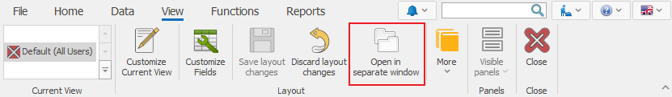

# Open in separate window

With the ***Open in separate window*** function, you can work on *multiple screens* at the same time.
This feature could be useful for dispatchers, planners, shift supervisors, team leaders, and employees preparing reports.
You can open a new window *along with* the main one or move it to a *new monitor*. 

You can temporarily open a form in a new window, or <b>save it in View</b>. To use the feature, go to the <b>Command ribbon >> View >> Open in separate window</b>.

 

Other ways to open in a separate window are by either right clicking on the Field tab and choosing <b>Floating Window</b>, or by dragging it out of the Main window.  

 

If you need that Form to continue opening in a separate window after closing the program, go to *Customize current view* mode and click on <b>Save layout changes</b>.  
When you open a <b>Navigator</b> in a separate window, each record will be open in *a new window*.
